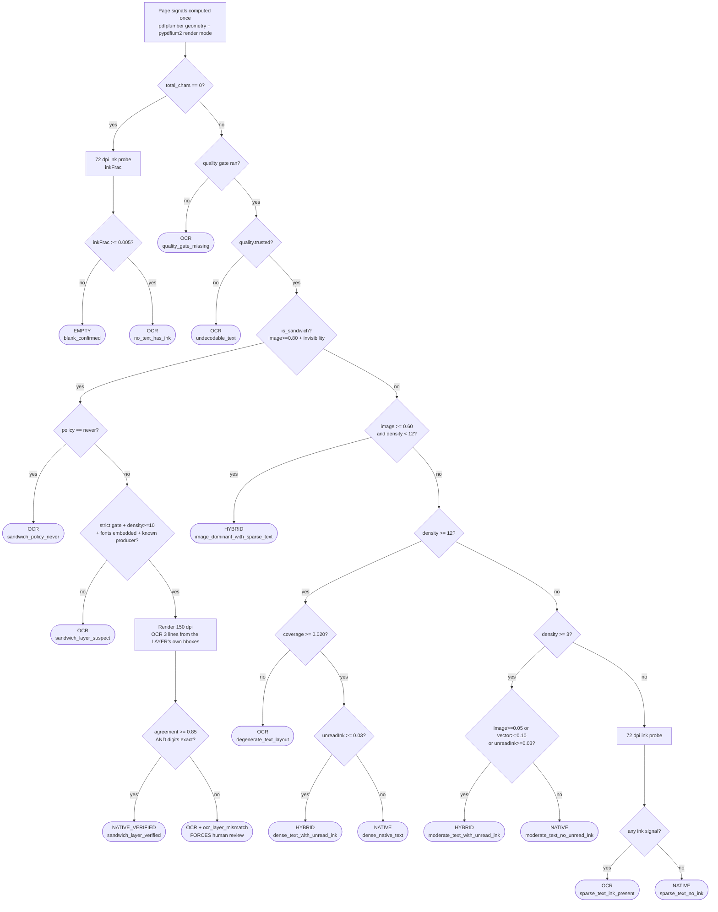

# C3 — OCR Routing Policy

> **Integration status (2026-09-12):** Read the [architecture index](../README.md) and its consolidation report before using these examples. Individual review labels do not close cross-document conflicts; no application implementation is verified.

> **This document owns every routing decision in INNOVERA OCR AI**: whether a page is read
> natively or rasterised, at what DPI, whether recognition runs twice, whether a second engine
> runs, whether a region is printed or handwritten, and when a page or span stops being a
> machine's business and becomes a human's. No other document may define a native-vs-OCR gate,
> a recognition escalation trigger, or a routing threshold. Cite this file as
> `c3-ocr-routing-policy.md §CANONICAL VALUES → <key>`.
>
> **What this document does NOT own.** Physical caps (bytes, pixels, pages, timeouts,
> concurrency) belong to `f2-canonical-limits.md` and are **cited, never restated**. Field-level
> confidence scores, calibration maps and the field auto-accept gates belong to
> `f-preprocessing-and-confidence.md` §2.2–2.7. Tenant scoping, the `DocumentAccess` chokepoint
> and the DB roles belong to `f1-tenant-visibility-model.md`. AI process placement, egress and
> credentials belong to `f3-ai-call-placement.md`.

---

## 1. Why this document exists: contradiction 2, stated precisely

M0 shipped **two independent, always-on, disagreeing native-vs-OCR gates**, in two documents,
executed by two different processes, using two different PDF libraries, on two different units.
`e-native-extraction-routing.md` §1 (:62) states the invariant — *"there must be exactly one
implementation of the routing heuristic"* — and the M0 corpus violates it in the very next
document. `f-preprocessing-and-confidence.md` §P1b marks its rival gate **"This must exist from
M1 day one."**

The adversarial panel found this independently in **two separate lenses** (P4/feasibility
finding 4, P4/operations finding 1) and drew the operational conclusion that makes it a
milestone blocker rather than a tidy-up:

> *"routing behaviour depends on which worker touched the page first, and there is no single
> place to change a threshold at 3am."*

### 1.1 The two competing heuristics, tabulated

| Aspect | **E** — `e-native-extraction-routing.md` §4.3 `route_page()` | **F** — `f-preprocessing-and-confidence.md` §P1b "born-digital fast path" |
|---|---|---|
| Owner process | the extractor service (`/v1/extract`) | the **OCR worker**, Tier 0, before any other op |
| Library | `pdfplumber` (geometry) + `pypdfium2` (render mode) + `pypdf` (visitor) | `pypdfium2==5.13.0` only |
| Text-quantity unit | `charDensity` = non-whitespace chars **per in²** of page box | **absolute** count of extractable chars |
| Text-quantity threshold | `T_DENSE = 12.0` chars/in² (≈1,160 on A4); `T_SPARSE = 3.0` (≈290 on A4) | **`≥ 20` characters**, full stop |
| Layout sanity | `textCoverageRatio ≥ 0.020` (200×200 rasterised coverage mask) | **none** |
| Image test | five area thresholds: `0.05 / 0.15 / 0.25 / 0.60 / 0.80` | **`imageCount < 3` AND `imageArea < 0.50`** |
| Vector-ink test | `T_VECTOR_PRESENT = 0.02`, consulted **only** when `total_chars == 0` | none |
| Garbage test | `garbageRatio < 0.02` (U+FFFD + PUA + C0) | **`U+FFFD + PUA ratio < 0.005`** |
| Unicode-category test | **none** | **`unicodedata.category` never `Cn`/`Co`** |
| Thai orthography | `orphanMarkRatio < 0.15`, `danglingPreVowelRatio < 0.20`, `thai+ascii > 0.90` | **none** |
| Pixel cross-check | **none** — the page is never rendered on the NATIVE path | **Thai-block ratio within ±0.25 absolute of an OCR sample on a 3-line crop** |
| Output cardinality | 7 routes (`NATIVE / HYBRID / OCR / EMPTY / VECTOR_ONLY / SKIPPED / FAILED`) | binary: **skip OCR** / fall through |
| Self-declared status | "there must be exactly one implementation" (§1 :62) | **"This must exist from M1 day one."** (§P1b) |

### 1.2 Five documents where they produce opposite answers

| # | Real page shape | **E** decides | **F** decides | Divergence class |
|---|---|---|---|---|
| 1 | Scanned signature page appended to a contract: 25-char native header, 2 raster images covering 45% of A4 | `charDensity = 25/96.68 = 0.26` → sparse band → `imageAreaRatio 0.45 ≥ 0.15` → **OCR** | ≥20 chars, <3 images, <50% area → **skip OCR** | **Silent loss.** F loses exactly the signature page that E §4.1 case 1 exists to protect |
| 2 | Thai quotation (ใบเสนอราคา) exported from Word: dense native body + pasted JPEG signature block and red seal (ตราประทับ) at 20% of A4 | `charDensity ≈ 30 ≥ 12`, `imageAreaRatio 0.20 < T_IMAGE_SIGNIFICANT 0.25` → **NATIVE** | <3 images, <50% → **skip OCR** | **Both wrong.** Seal and signatory name are never read, and neither doc emits a warning |
| 3 | Broken-cmap Thai PDF: 3,000 chars extracting as PUA + mojibake | `garbageRatio ≥ 0.02` → **OCR** (`undecodable_text`) | PUA ratio ≥ 0.005 → **fall through to OCR** | Agree by accident, on different constants (4× apart) |
| 4 | PDF-generator artefact: 5,000 zero-width / stacked glyphs at one coordinate | `charDensity 40 ≥ 12`, `coverage 0.001 < 0.02` → **OCR** (`degenerate_text_layout`) | ≥20 chars, no images → **skip OCR** | **Silent loss.** F has no layout sanity check at all |
| 5 | Tesseract sandwich, orthographically clean Thai layer, digits wrong (`฿17,400` rendered, `฿1,740,000` in the invisible layer) | `trusted_strict` → **NATIVE** `sandwich_layer_clean` | Thai-block ratio matches within ±0.25 → **skip OCR** | **Both wrong, and worse than loss: silent substitution.** Neither doc compares text to pixels on digits |

Cases 1, 2, 4 and 5 all fail **silently**: the page reports success, the UI shows a clean
extraction, and `f` §2.6's review gates have nothing to fire on because a NATIVE page carries
`confidence = null` by construction (`e` §12.1). Case 5 is a **content-forgery channel** — the
panel's headline security finding — because a forged layer scores *perfectly* on an
orthography-only gate, and `k`'s grounding verifier then grounds the forged value at maximum
score against the forged text.

### 1.3 The arbitration in one sentence

**E's per-page architecture and signal set survive; E's control flow and constants do not; F's
gate is deleted outright and its two genuinely-new predicates (the `Cn`/`Co` category check and
the render-and-compare pixel cross-check) are promoted into this document as first-class rules.**

**Added in review.** E's *signal definitions* do not survive intact either. `charCount`,
`charDensity` and `textCoverageRatio` as `e` defines them count **invisible** characters, which
makes every native-sufficiency threshold in this document forgeable by an uploader (C3-D9,
§1.4). Those three signals are redefined here over visible text only, and the parser split that
made per-character visibility unusable — the panel's fifth feasibility finding, previously
unaddressed anywhere in M0.5 — is resolved in C3-D9.

### 1.4 A third silent-substitution shape, found in this review pass

Neither M0 nor the first draft of this document closes it, and it survives every rule in §4 as
first written:

> One page. A full-bleed 300-dpi scan of a forged invoice at `imageAreaRatio = 0.70` (below the
> `0.80` sandwich trigger, so the sandwich branch never runs). Underneath it, ~1,200 characters
> of **invisible** (`Tr 3`) clean Thai at ~13 pt with zero leading and zero margins, so the glyph
> boxes tile ~78% of the page. Signals: `charDensity ≈ 12.4 ≥ 12` (dense band, R11),
> `textCoverageRatio ≈ 0.78 ≥ 0.020` (R9 does not fire),
> `unreadInkRatio = coverage(image) − coverage(image ∩ words) = 0.70 − 0.68 = 0.02 < 0.03`
> (R10 does not fire). **Route: `NATIVE`.** The page is never rasterised, and the forged
> invisible text is emitted as the page's content.

The attacker's whole primitive is that **invisible glyph boxes count as evidence that the page
was read**. Every constant in §4 is sound; the *inputs* were forgeable. C3-D9 removes the
primitive at the root by making visibility a term in the signals themselves, which is cheaper
and more durable than adding a fourth threshold that an attacker aims at next.

---

## 2. The owner's hierarchy, mapped to mechanism

| # | Owner requirement | Mechanism in this document | Enforcement |
|---|---|---|---|
| 1 | Native extraction first where structurally reliable | §4 `route_page_v2()` rules **R2–R15**, `NATIVE` / `NATIVE_VERIFIED` | one implementation, CI-enforced (C3-D1) |
| 2 | OCR only for raster/scanned regions/pages | §4 rules **R1, R4–R9, R12, R14** + §5 residual-ink rule | `unreadInkRatio` upgrades NATIVE→HYBRID |
| 3 | Printed vs handwriting classification | §8 per-line `RecognitionClass` classifier, 3 numeric features, 2-of-3 rule | `autoAcceptEligible = false` on every handwritten span |
| 4 | Low-confidence second-pass recognition | §7 the escalation ladder: **structural triggers only**, never a raw score | one bounded ladder, one pass-unit ledger |
| 5 | Multi-engine verification where justified | §9 triggers V1–V4 + the agreement rule | never resolved by comparing engine scores |
| 6 | Qwen semantic understanding AFTER recognition | §10 stage ordering; AI consumes `[PAGE n]` only | `ocr-ai-worker` cannot reach pixels (f3) |
| 7 | **The LLM never becomes OCR-of-record** | §10.2 four independent structural barriers | DB grant, filesystem mount, port shape, CI lint |

---

---

## 2.1 Definitions the routing table depends on

Every predicate used in §4 is defined here as an expression over `PageSignals`. M0 left six of
them implicit — `is_sandwich`, `fontSubstitutionRisk`, `ocrLayerFingerprint`, `pageAreaIn2`,
`normalisedLevenshtein`, and the visible/invisible split — and **an implicit predicate is a
threshold nobody can sweep, review or attack-test.** Anything not defined here is not a gate.

### 2.1.1 Visible and invisible text

Per C3-D9, the character stream and its per-character visibility come from **one** parser
(PDFium's textpage), never from two joined by bbox proximity.

```
visible(c)  :=  renderMode(c) != 3                       # Tr 3 = invisible
            and not whiteFillOnWhiteBackground(c)        # e §4.5a whiteFillCharRatio test
            and fontSizePt(c) >= OCR_ROUTE_MIN_VISIBLE_FONT_PT      (= 4.0)
            and glyphBox(c) intersects the CropBox

visibleCharCount    = |{c : visible(c)}|                 # after the zero-width strip
invisibleCharCount  = |{c : not visible(c)}|
invisibleCharRatio  = invisibleCharCount / (visibleCharCount + invisibleCharCount)
```

`OCR_ROUTE_MIN_VISIBLE_FONT_PT = 4.0` is taken from `j-security-threat-model.md` (:862) rule (5),
which already names "under 4 pt" as a hidden-text signal; it is restated here **only** because
`j` states it as a detection heuristic and this document needs it as a routing term. `j` remains
the owner of the injection-detection use.

### 2.1.2 The three native-sufficiency signals, over visible text only

```
pageAreaIn2       = (cropW_pt/72) * (cropH_pt/72) * userUnit**2
charCount         = visibleCharCount                     # REDEFINED — was all characters
charDensity       = charCount / pageAreaIn2              # chars per square inch
textCoverageRatio = coverage(visible glyph boxes)        # on the 200x200 boolean mask
words             = the visible word boxes only          # the subtrahend in unreadInkRatio
total_chars       = charCount + annotationTextCharCount + acroFormFieldCharCount
```

Two definitional facts `e` establishes and this document adopts unchanged, because getting them
wrong moves every density threshold:

- **`pageAreaIn2` is computed on the page box a human sees** — the CropBox intersected with the
  MediaBox, never a bare MediaBox (`e` §4.8a item 3). An oversized MediaBox with a small CropBox
  understates `charDensity` and pushes good pages to OCR; the reverse understates nothing but is
  not expressible, so the failure is one-directional and safe, and it is still wrong.
- **`/UserUnit` multiplies the effective physical size** and is read, applied and recorded, never
  assumed to be 1.0 (`e` §4.8a item 4). It is squared here because it scales both axes.

### 2.1.3 `is_sandwich`, `fontSubstitutionRisk`, `ocrLayerFingerprint`

```
is_sandwich := imageAreaRatio  >= OCR_ROUTE_SANDWICH_IMAGE_AREA_FRAC_MIN   (0.80)
           and invisibleCharRatio >= OCR_ROUTE_INVISIBLE_CHAR_FRAC_MIN     (0.50)

fontSubstitutionRisk := nonEmbeddedFontCharRatio >= OCR_ROUTE_NONEMBEDDED_FONT_RATIO_MIN (0.50)

ocrLayerFingerprint := the first match, else None, of an ALLOWLIST of producer signatures
    matched against (/Producer, /Creator, the font BaseFont names, the XMP CreatorTool)
```

`OCR_ROUTE_SANDWICH_PRODUCER_ALLOWLIST` ships with exactly five entries and is config, not code:
`tesseract` (`GlyphLessFont` / `/Producer` containing `Tesseract`), `ocrmypdf`, `abbyy`
(FineReader), `adobe_scan`, `foxit_ocr`. **A producer outside the allowlist yields `None`, and
`None` is disqualifying** (R5) — the reverse of `e` §4.5(d), where a Tesseract fingerprint was
read as *evidence the layer is genuine* and therefore as the reason to enter the trust branch.
The allowlist is not a trust decision; it is an *eligibility* decision, and eligibility is
followed by a pixel test that the fingerprint cannot influence.

> Every one of those five strings is attacker-writable in a crafted PDF. That is intentional and
> harmless: forging a fingerprint only buys entry to C3-D3's verification, which compares the
> layer to the pixels. The allowlist exists to keep the *cost* of verification off pages that
> cannot benefit, never to establish trust.

### 2.1.4 The two comparison folds, and why there must be two

`thaiFold()` is **owned by `f-preprocessing-and-confidence.md` D18 / §2.4 step 2** — "NFC, then
an explicit Thai mark reordering, then explicit `ำ ↔ ํ+า` folding, comparison-only, never
stored". It is cited here, never restated.

> **Review correction.** The first draft of this document defined `thaiFold()` as
> "NFC then `pythainlp.util.normalize`, attributed to `d` §7.4", three times. That was a
> restatement of a value another document owns **and it disagreed with the owner.** It was also
> substantively wrong for this document's purpose: `pythainlp.util.normalize()` is documented as
> `remove_zw()` → `remove_dup_spaces()` → `remove_repeat_vowels()` → `remove_dangling()`, i.e. it
> **removes repeated tone marks and reorders vowel/tone sequences** ([PyThaiNLP util
> API](https://pythainlp.org/docs/5.0/api/util.html)). Those are precisely the differences a Thai
> OCR verifier exists to detect. Folding both sides with it before scoring agreement erases the
> evidence and biases every verifier toward *accepting*. `d` §7.4 recommends
> `pythainlp.util.normalize` for one narrow job — unifying `ํ` + `า` with `ำ` — not as a
> comparison fold.

This document therefore owns two named compositions and uses each for exactly one job:

| Fold | Definition | Used for | Why |
|---|---|---|---|
| `compareFold(s)` | NFC(s), zero-width stripped (§CANONICAL VALUES → `zero_width.rule`), Thai digits `๐–๙` mapped to ASCII (`e` §4.4b). **Mark-preserving and order-preserving.** | every **agreement** score: C3-D3 sandwich verification, C3-D8 multi-engine, §7.3 variant ranking | a fold that erases mark errors cannot measure mark errors |
| `dedupFold(s)` | `thaiFold(s)` per `f` D18 | **only** HYBRID region dedup (§5) | over-matching is safe when the consequence is suppressing a duplicate line |

`OCR_ROUTE_COMPARE_FOLD = "nfc_mark_preserving"` and `OCR_ROUTE_DEDUP_FOLD = "f_thaifold_d18"`
are config-visible names so a future change is a versioned event, not a silent one.

### 2.1.5 `normalisedLevenshtein`, `agreement`, and the mark sub-score

```
normalisedLevenshtein(a, b) = levenshtein(a, b) / max(len(a), len(b))     # NFC code points
agreement(a, b)             = 1 - normalisedLevenshtein(compareFold(a), compareFold(b))
markAgreement(a, b)         = agreement(marksOnly(a), marksOnly(b))
    where marksOnly(s) = the subsequence of s in
          {U+0E31, U+0E34..U+0E3A, U+0E47..U+0E4E}
digitRuns(s)                = the maximal ASCII-digit runs of compareFold(s), in order
```

If `max(len(a), len(b)) == 0` the pair is **not** agreement 1.0 — it is
`sandwich_sample_insufficient` / `verification_sample_empty`. An empty comparison that scores
perfectly is how a verifier gets silently disabled.

**Levenshtein is computed on code points, not grapheme clusters, and that is deliberate.** A Thai
grapheme cluster is base + up to two marks; clustering would make one wrong tone mark cost the
same as a wrong consonant, which is the opposite of what this pipeline needs to see. It also
matches `d` §7's rule that Thai quality is measured as **CER, never WER**, because Thai word
segmentation is itself subjective (`d` §7, quoting ThaiOCRBench).

**Why `markAgreement` exists at all — a Thai-specific hole in whole-string agreement.** Above-
and below-base marks are roughly 15% of the characters in running Thai. A whole-string
`agreement` gate at `0.85` is therefore **exactly satisfiable by a candidate in which every
single tone mark is wrong or missing** — and tone-mark erasure is the characteristic failure
mode of Thai OCR at low DPI and of aggressive binarisation, which is to say it is *our* most
likely failure and the one the whole-string gate is blindest to. `OCR_ROUTE_MARK_AGREEMENT_MIN
= 0.70` is a second, independent gate on the mark subsequence, applied wherever `agreement` is
applied. **PROVISIONAL** (§13).

---

## 3. Decisions

Every decision below carries the owner's eight-part shape: competing proposals → selected →
rejected → reason → implementation consequence → migration consequence → security consequence →
config/env consequence.

---

### C3-D1 — One routing owner, one implementation

**Competing proposals.**
(a) `e` §4.3 `route_page()` in the extractor service, "exactly one implementation" (`e` §1 :62).
(b) `f` §P1b born-digital fast path in the OCR worker, Tier 0, "must exist from M1 day one".
(c) Panel/feasibility item 5 and panel/operations item 1: delete (b), make (a) sole owner, add a
CI guard.

**Selected: (c).** `route_page_v2()` (§4) is the **sole** native-vs-OCR decision in the system.
It runs **once**, in the extractor, and its output — `route`, `reason`, `thresholdsVersion`, and
the full `PageSignals` blob — is persisted on `document_pages` and **consumed** by every
downstream stage. No other module may recompute it.

**Rejected: (b) as an independent gate.** F's gate is strictly more permissive on the mixed page
(table §1.2 cases 1, 2, 4), has no layout sanity check, and executes in a process that has
already lost the PDF object graph. Its *motivation* — never pay for OCR on a printer-driver PDF —
is fully served by (a), which routes exactly those pages `NATIVE`.

**Rejected: merging F's thresholds into E's.** Two of F's four criteria (`≥20 chars`,
`<3 images / <50% area`) measure the same things E measures, worse. Keeping them as extra
predicates would preserve the ambiguity this document exists to remove.

**Reason.** A routing decision that two processes can reach independently is not a policy, it is
a race. The panel's operations lens is decisive: with two gates there is no single place to
change a threshold during an incident, and no way to state what the system did.

**Implementation consequence.** `services/ocr-worker/` imports `PageRoute` and consumes
`page.route`; it does **not** import or reimplement `route_page_v2`. The born-digital saving
that F §P1b existed to capture is realised in the extractor instead, and is larger, because E
also catches case 4 (degenerate layout) which F would have skipped.

**Migration consequence.** `PageRoute.VECTOR_ONLY` is **deleted from the enum** and
`NATIVE_VERIFIED` is added (C3-D3, C3-D5), so `document_pages.route` gains a `CHECK` over the
**seven** resulting values — `e`'s enum also had seven, so the cardinality is unchanged even
though the membership is not. Because no rows exist yet
(M1 has not shipped), this is a definition, not a migration. Any future route added is an
enum-widening migration plus a `thresholdsVersion` bump.

**Security consequence.** One gate means one audited decision path. Two gates meant the *weaker*
one bounded the system's safety, and the weaker one (F) had no orthographic gate, so a
broken-cmap Thai PDF passing F's `≥20 chars` test would have been emitted as text.

**Config/env consequence.** `OCR_ROUTE_IMPL_GUARD=strict` (default `strict`). A CI rule
(`dependency-cruiser` + a grep lint mirroring E's existing `SAFE_PARSER` / `import fitz` guards)
fails the build if any module outside `services/extractor/routing/` computes a character-count
or image-area comparison against a page. Boot refuses if the worker image contains a second
routing module.

---

### C3-D2 — Ink corroboration replaces feature enumeration

**Competing proposals.**
(a) `e` §4.3 step 0: enumerate ink sources — `imageAreaRatio ≥ 0.05` → OCR, else
`vectorInkRatio ≥ 0.02` → `VECTOR_ONLY`, else `EMPTY`.
(b) Panel/security item 2: render at 72 dpi and measure actual ink; if the analyser reported no
ink and the renderer disagrees, route `OCR`.

**Selected: (b), as rule R0/R1**, and extended to every route that would otherwise terminate
**without ever rasterising the page**: `EMPTY`, and `NATIVE` where
`total_chars < OCR_ROUTE_SPARSE_CHARS_PER_IN2 × pageAreaIn2`.

The probe is `f` §1.2b's existing A0 `inkFrac` measurement (`workBin` foreground fraction,
`<1 ms`), applied to a 72-dpi greyscale render (A4 ≈ 0.5 MB, single-digit ms). It is **reuse, not
new machinery**. Threshold: `OCR_ROUTE_INK_PROBE_MIN_FRAC = 0.005`.

**Rejected: (a).** It enumerates PDF features and therefore fails on every feature it does not
enumerate. Two are already known: **annotation appearance streams** (pdfminer does not process
APs — pdfplumber issue #531 — so a page inked entirely by a stamp or FreeText annotation scores
`charCount 0, imageAreaRatio 0, vectorInkRatio 0` → `EMPTY`), and **tiling-pattern fills**. `e`
§5.1 sets `draw_annots=True` *because* "Thai business PDFs carry stamps and signatures as
annotations surprisingly often" — so the renderer draws ink the router cannot see. That is the
same root cause as case 1 in §1.2, arriving through a different door.

**Reason.** The routing decision must be made against the *same* rendering of the page a human
sees. One measurement of actual ink closes annotation APs, tiling patterns, outlined text, and
every future pdfplumber/PDFium divergence, permanently. Enumeration cannot.

**Implementation consequence.** The extractor gains a 72-dpi render path it did not have. Cost:
`OCR_ROUTE_INK_PROBE_DPI = 72` on A4 is 595 × 842 = **0.50 Mpx** greyscale ≈ 0.48 MiB and ≈ 8 ms
(the first draft said 0.55 Mpx; corrected). The probe runs only on pages that would terminate
without rendering, i.e. the cheap population, and is bounded by
`f2 §CANONICAL VALUES → PAGE_RENDER_TIMEOUT_S` like every other render. It is charged to its
own counter, `OCR_ROUTE_INK_PROBE_MAX_PAGES_PER_DOC = 200`, and **not** to the extra-pass ledger
— see §7.4.

**Migration consequence.** None — new pages only. Documents processed before a
`thresholdsVersion` that includes the probe are re-routable by the backfill query in C3-D13.

**Security consequence.** This is the primary control against the *silent substitution* class:
an attacker cannot make the analyser and the renderer agree that a page is empty when it is not.
`analyzer_renderer_disagreement` is a first-class page warning and forces the page to `OCR`.

**Config/env consequence.** `OCR_ROUTE_INK_PROBE_DPI=72`,
`OCR_ROUTE_INK_PROBE_MIN_FRAC=0.005`, `OCR_ROUTE_INK_PROBE_ENABLED=true`. Setting
`OCR_ROUTE_INK_PROBE_ENABLED=false` is permitted only with
`OCR_ROUTE_PROFILE=fast` and stamps `inkProbeSkipped` on every affected page.

---

### C3-D3 — Third-party OCR layers are verified against pixels, never trusted on orthography

**Competing proposals.**
(a) `e` §4.5: default `trustExistingOcrLayer = "if-clean"` — trust a sandwich layer that passes
the strict orthographic gate at `charDensity ≥ 10`.
(b) Panel/feasibility item 2: ship `"never"` as the default; make `"if-clean"` opt-in per tenant.
(c) Panel/security item (1): **delete** the trust edge; replace with a **verify** route — render
at 150 dpi, OCR 2–3 line boxes sampled **from the invisible layer's own bboxes**, require
per-line agreement ≥ 0.85 after `thaiFold()`. *(As the panel wrote it. Both the uniform-random
sampling and the choice of fold are corrected below — see step 3 and §2.1.4.)*
(d) `f` §P1b's weaker version: Thai-block ratio within ±0.25 of an OCR sample on a 3-line crop.

**Selected: (c), with (d)'s cost model and one addition (c) lacks — digit exactness.**

```
policy.sandwich ∈ { "verify" (DEFAULT), "never" }          # "always" is DELETED from the type
```

Verification procedure, exact:

1. Enter only when `imageAreaRatio ≥ 0.80` AND an invisibility signal fires AND
   `quality.trusted_strict` AND `charDensity ≥ 10.0` AND **not** `fontSubstitutionRisk` AND
   `ocrLayerFingerprint is not None`. Any failure → `OCR / sandwich_layer_suspect`.
2. Render once at `OCR_ROUTE_SANDWICH_VERIFY_DPI = 150` greyscale.
3. **Select the sample deterministically, digits first.** Sampling from the layer's own geometry
   — not from the whole page — is what makes the comparison an identity test rather than a
   coverage test. But *uniformly at random from all of the layer's boxes*, as the panel proposed
   and as this document's first draft adopted, is **defeated by the attacker who wrote the
   boxes**: seed a forged page with 400 short decoy lines whose text does match the pixels, hide
   the altered total in one of them, and a 3-of-400 uniform sample misses it with probability
   ≈ 0.9926. Selection is therefore **prioritised, capped and reproducible**:

   ```
   D = boxes whose layer text contains a digit run of length >= OCR_ROUTE_MULTIENGINE_DIGIT_RUN_MIN_LEN
   if |D| > OCR_ROUTE_SANDWICH_VERIFY_MAX_LINES (12):
        -> OCR / sandwich_too_many_digit_lines      # unverifiable within budget; do not sample
   sample = D
        + the (OCR_ROUTE_SANDWICH_VERIFY_LINES - |D|) longest remaining boxes, if |D| < 3
   seed   = sha256(documentId || pageNumber || thresholdsVersion)   # ties broken deterministically
   ```

   **Every digit-bearing line is verified or the page is not verified at all.** There is no
   sampling gap on the only content class this product loses money on. Ties among equal-length
   boxes are broken by the seed, so the same page yields the same sample on every run — a
   requeue (`f1 §CANONICAL VALUES → uniq.document_run_seq`) must be able to reproduce a routing
   decision, and a randomised gate cannot be re-run, regression-tested, or explained to a
   customer.
4. If the sampled boxes carry fewer than
   `OCR_ROUTE_SANDWICH_VERIFY_MIN_SAMPLE_CHARS = 30` characters in total, the sample is not
   evidence → `OCR / sandwich_sample_insufficient`.
5. **Preprocess the crops through Tier 0/1 and detect, then recognise with the primary engine** —
   i.e. this is a bounded, nested invocation of §10.1 steps 4–7 on `≤ 12` crops, not a raw call
   into the recogniser. Recognising un-preprocessed crops would compare a full-pipeline layer
   against a no-pipeline recognition and depress `agreement` on genuine layers, which is a
   false-reject generator pointed at exactly the population this branch exists to save. Each
   crop render is bounded by `f2 §CANONICAL VALUES → PAGE_RENDER_TIMEOUT_S` and the batch by
   `f2 → PAGE_OCR_TIMEOUT_S`; a timeout is `OCR / sandwich_verify_timeout`, never an accept.
   Compute `agreement` and `markAgreement` per line, per §2.1.5, under `compareFold()` —
   **not** under `thaiFold()`, for the reason given in §2.1.4.
6. **Accept** iff **all three** hold:
   `mean(agreement) ≥ OCR_ROUTE_SANDWICH_VERIFY_AGREEMENT_MIN = 0.85`
   **and** `mean(markAgreement) ≥ OCR_ROUTE_MARK_AGREEMENT_MIN = 0.70`
   **and** every digit run in every sampled line matches character-for-character after Thai-digit
   normalisation (`OCR_ROUTE_SANDWICH_VERIFY_DIGIT_EXACT = true`).
   → `NATIVE_VERIFIED`, `extractionMethod = pdf.existing_ocr_layer`,
   `attrs.layerVerified = "sampled"`, all three scores recorded.
7. Otherwise → `OCR`, page reason `ocr_layer_mismatch`, **document-level warning that forces
   human review** (§11 gate H4).

**Rejected: (a).** `trusted_strict` is a Thai **orthography** test. It measures whether a string
is well-formed Thai; it cannot measure whether the string matches the picture underneath it, and
nothing else in the M0 design does either. A forged layer does not merely evade it — it scores
**perfectly**, because an attacker writes clean text. `e` §4.9's own reversal criterion ("flip to
`never` if calibration shows >10% of clean-gating layers are materially worse") is unmeasurable
*before* the calibration corpus exists, so the risky default was on during precisely the window
in which it was unvalidated. And `e` §4.5a's supporting argument — that consumer scanners
"produce a layer of Latin gibberish which the §4.4 gate rejects outright" — is true of
*no-Thai-model* firmware and simply untrue of Tesseract-tha, ABBYY FineReader Thai and Adobe
Scan, which are the sandwich producers a Thai office actually generates.

**Rejected: (b) `"never"` as default.** It is safe but it throws away the entire economic case
for reading a sandwich, and the cost of (c) is small: one 150-dpi greyscale render (A4 = 2.1 MiB)
plus three line recognitions ≈ **0.25 pass units** versus **1.0** for a full re-OCR — a 4×
saving on a population that is a large fraction of a Thai office corpus. `"never"` remains
available per tenant for accuracy-critical workloads.

**Rejected: (d) alone.** Comparing Thai-block *ratios* within ±0.25 compares two histograms. It
passes case 5 in §1.2 trivially, because a forged Thai layer and the real Thai page have
identical Thai-block ratios. It is a script check, not an identity check.

**Rejected: `"always"` remaining in the type.** `e` §1 puts `policy` in the `/v1/extract`
request body and §4.5 says `"never"` "should be selectable per-tenant" — which implies the whole
`Literal` is tenant-reachable, including `"always"`, which returns NATIVE for any sandwich page
with **no quality gate at all**. Deleting the variant is cheaper than defending it.

**Reason.** Orthography measures whether a string is well-formed Thai. The question this branch
must answer is whether the string *is the string in the picture*, and no orthographic test can
reach it — a forged layer scores perfectly, because an attacker writes clean text. The only
instrument that answers the actual question is the pixels, so the pixels are consulted. The
economics decide *how much* of the page is consulted, not *whether*.

**Why 0.85 and not the 0.90 the feasibility lens proposed — with the evidence corrected.** The
first draft argued that 0.90 "sits inside the noise band of *our own* primary engine" and then
cited Typhoon 1.5. **Typhoon is not our primary engine** (`d` §1: primary is PP-OCRv5-th; Typhoon
is the GPU-gated escalation tier), so that argument used a different engine's benchmark to
characterise ours. Corrected, the evidence is:

| Evidence | Value | What it is | What it is not |
|---|---|---|---|
| PP-OCRv5-th vendor claim (`d` §3.1) | **82.68%** accuracy on a vendor-built 4,261-crop Thai eval set | the only published number for **our primary engine** | not a CER, not per-character, and not on our documents — `d` (:1278) calls it "a vendor *line* accuracy" |
| Typhoon OCR 1.5, ThaiOCRBench (`d` §3.2 Table 7) | 6.2% median / 16.8% mean CER | the best externally-built Thai CER in the corpus, for a **different, GPU-only** engine | not evidence about PP-OCRv5-th |
| Wayu-Paxa-OCR-Zero, held-out print (`d` §3.2 Table 7) | 1.24% median / 14.75% mean CER | corroboration that Thai print CER **means diverge from medians by ~10×** | not evidence about PP-OCRv5-th |

Read honestly: **no CER for our primary engine on Thai exists anywhere in this corpus.** What the
table does establish, three times over, is that Thai print CER *means* land in the 5–17% band
even for good models, i.e. an expected per-line `agreement` of roughly 0.83–0.95 with a long
left tail. A 0.90 gate sits inside that band and would reject clean layers on our own error rate,
making `verify` behave as `never` while still paying `verify`'s cost. 0.85 sits at its lower
edge. **It is a prior with a wide error bar, not a measurement, and it is the single most
likely threshold in this document to be wrong.**

Two consequences follow, and both ship:

- `OCR_ROUTE_SANDWICH_VERIFY_REJECT_RATE_ALARM = 0.30`. If more than 30% of pages entering
  verification are rejected, the gate is mis-set rather than the corpus being forged, and the
  operator is told so *by an alarm* rather than by a support ticket about missing text. The
  documented response is to measure before moving the threshold, never to lower it under
  pressure — lowering it is the one change that silently re-opens the forgery channel.
- The 0.85/0.70 pair is a **hard M1 pre-flight measurement** (§13, §15 M-R7), not an M2 nicety:
  30 genuine Thai sandwiches through the real pipeline, reporting the `agreement` and
  `markAgreement` distributions. That is a half-day of work once any sandwich corpus exists.

**Failing safe is asymmetric here and the asymmetry is deliberate.** A false *reject* costs one
full re-OCR (money, and a page that is read correctly anyway). A false *accept* emits an
attacker's text as the document's content. The three conditions are therefore deliberately
mismatched in kind: `agreement` is a fuzzy text test tolerant of our own error, `markAgreement`
is a narrow test on the characters Thai OCR actually drops, and digit exactness is an exact
numeric test — because the forgery class *is* digits.

**Implementation consequence.** The extractor needs a synchronous call into the OCR engine for
three line crops. That inverts an M0 assumption (`e` §1's one-shot `/v1/extract` returns before
any OCR runs). Resolution: sandwich verification is a **bounded, in-extractor** recognition using
the same registered `OcrProvider` (`d` §9), not a callback — the extractor container therefore
carries the primary engine. This is already true in `m`'s image layout (the worker and extractor
share one Python image); it is now a **requirement**, not a coincidence.

**Migration consequence.** `document_pages.route` gains `NATIVE_VERIFIED`;
`ocr_results` gains rows with `engineId = <primary>` and `renderDpi = 150` for the sampled
crops (up to `OCR_ROUTE_SANDWICH_VERIFY_MAX_LINES` per page), which is legal under the frozen
`f1 §CANONICAL VALUES → uniq.ocr_result` composite key
`(documentPageId, runId, engineId, engineVersion, renderDpi)` — a later full re-OCR at 300 dpi is
a different `renderDpi` and does not collide. **This is a case the frozen key was designed for
and it works unmodified.**

**Security consequence.** This closes the panel's headline finding. It also resolves a
head-on contradiction between two M0 documents: `j-security-threat-model.md` (:862) says hidden
text "is invisible to the human reviewer and is therefore *only* addressed to the model. Treat it
as a strong injection signal, and exclude it from the text sent to the model", while `e` §4.5a
rule 4 emitted exactly that text as the page's content. **Resolution: `e` §4.5a rule 4 is
superseded.** An invisible layer is emitted **only** on `NATIVE_VERIFIED`, only after pixel
agreement, and it carries `attrs.layerVerified="sampled"` into `e` §13.1's page attributes so
the AI layer can see that the page's text came from a third party — it is no longer serialised
as a bare, default `[PAGE n]`.

**Config/env consequence.** `OCR_ROUTE_SANDWICH_POLICY=verify` (server-derived from tenant
config; **never** read from a request body — see C3-D10), `OCR_ROUTE_SANDWICH_VERIFY_DPI=150`,
`OCR_ROUTE_SANDWICH_VERIFY_LINES=3`, `OCR_ROUTE_SANDWICH_VERIFY_MAX_LINES=12`,
`OCR_ROUTE_SANDWICH_VERIFY_AGREEMENT_MIN=0.85`, `OCR_ROUTE_MARK_AGREEMENT_MIN=0.70`,
`OCR_ROUTE_SANDWICH_VERIFY_MIN_SAMPLE_CHARS=30`, `OCR_ROUTE_SANDWICH_VERIFY_DIGIT_EXACT=true`,
`OCR_ROUTE_SANDWICH_VERIFY_REJECT_RATE_ALARM=0.30`,
`OCR_ROUTE_SANDWICH_PRODUCER_ALLOWLIST` (5 entries, §2.1.3), `OCR_ROUTE_COMPARE_FOLD`.
Boot refuses if `OCR_ROUTE_SANDWICH_POLICY` is any value other than `verify` or `never`.

---

### C3-D4 — The text-quality gate gains a mapping test; the orthographic constants stand

**Competing proposals.**
(a) `e` §4.4 `assess()`: `garbageRatio` (U+FFFD + PUA + C0) + three Thai orthographic invariants.
(b) `f` §P1b: PUA+FFFD ratio < 0.005 **and `unicodedata.category` never `Cn`/`Co`**.

**Selected: (a) as the base, plus (b)'s category test as a new field `unmappedRatio`.**

```
unmappedRatio = |{c : unicodedata.category(c) in {"Cn", "Co"}}| / n     # after ZERO_WIDTH strip

normal gate  adds:  unmappedRatio < OCR_ROUTE_UNMAPPED_FRAC_MAX        = 0.005
strict gate  adds:  unmappedRatio == OCR_ROUTE_UNMAPPED_FRAC_MAX_STRICT = 0.0
```

`e`'s existing constants are retained verbatim and are now owned here:
normal — `garbage < 0.02`, `orphanMark < 0.15`, `danglingPreVowel < 0.20`,
`thai+ascii > 0.90`; strict — `0.005 / 0.05 / 0.08 / 0.97`;
`MIN_ASSESSABLE_CHARS = 40`.

**Rejected: replacing `garbageRatio` with F's 0.005.** They are not the same measurement at
different tightness: `garbageRatio` is `U+FFFD + PUA + C0`, and 0.02 on a *page* is the level at
which a broken cmap is unambiguous. F's 0.005 is the right number for the **strict** gate and is
already there.

**Rejected: dropping the orthographic invariants.** `orphanMarkRatio` and
`danglingPreVowelRatio` are **orthographic invariants of Thai**, not statistical guesses: a Thai
above/below mark following a space, digit or Latin letter is a decoding error, and a leading
vowel (`เ แ โ ใ ไ`) not followed by a consonant or another pre-vowel is invalid. They are the
single strongest native-Thai signal in the corpus and F has no equivalent.

**Reason for adding `unmappedRatio`.** `Cn` (unassigned) is genuinely orthogonal to everything
`e` measures. A subset font whose glyph indices land on unassigned codepoints produces
characters that are neither PUA, nor U+FFFD, nor C0 — they pass `garbageRatio`, they are not
Thai, they are not ASCII-printable, and the `thai+ascii > 0.90` term is the only thing that would
catch them, and only if they dominate. A page that is 92% clean Thai and 8% unassigned junk
passes `e`'s gate today. This is F's one real contribution and it is kept.

**Implementation consequence.** One additional pass over the codepoint list in `assess()`; no new
dependency (`unicodedata` is stdlib). `TextQuality` gains `unmappedRatio: float`; the wire name
is `unmappedRatio` in both Python and TypeScript (one name on the wire, matching `e` §12.2's
`trustedStrict` discipline).

**Migration consequence.** `PageSignals.quality` is persisted as JSONB; adding a field is
additive. `thresholdsVersion` bumps, which makes the added field queryable for backfill.

**Security consequence.** Closes a path by which attacker-chosen glyph indices produce text that
reaches the LLM as trusted native content.

**Config/env consequence.** `OCR_ROUTE_UNMAPPED_FRAC_MAX=0.005`,
`OCR_ROUTE_UNMAPPED_FRAC_MAX_STRICT=0.0`, plus the eight existing gate constants, all in
`config/routing.yaml`.

---

### C3-D5 — Residual ink, not image-area tiers; `VECTOR_ONLY` deleted

**Competing proposals.**
(a) `e` §4.3: five image-area thresholds (`0.05 / 0.15 / 0.25 / 0.60 / 0.80`) and a
`VECTOR_ONLY` terminal route.
(b) Panel/feasibility item 3: add a residual-ink rule to steps 4/5/6 and lower
`T_IMAGE_SIGNIFICANT` from 0.25 to 0.05.
(c) Panel/operations item 4: add `T_VECTOR_DOMINANT ≈ 0.10` producing `HYBRID`.
(d) Panel/feasibility item 4 and security item 2(a): make `VECTOR_ONLY` a rendering route.

**Selected: (b) + (c) + (d), unified into one rule and one deletion.**

```python
# Reuse the SAME 200x200 boolean coverage mask e §4.2a already builds. No new machinery.
unreadInkRatio = coverage(images ∪ vectors ∪ annotationAPs) − coverage((images ∪ vectors ∪ APs) ∩ words)
```

`OCR_ROUTE_UNREAD_INK_FRAC_MAX = 0.03`. Any page that would return `NATIVE` with
`unreadInkRatio ≥ 0.03` returns **`HYBRID`** instead. If the render budget forbids the upgrade,
the page stays `NATIVE` and carries a **mandatory** `unread_ink_area: <ratio>` warning that
propagates to the document warnings, to the UI, and to §11 gate H3.

**`T_IMAGE_SIGNIFICANT` (0.25) and `T_IMAGE_SPARSE_TRIGGER` (0.15) are DELETED**, not
re-tuned. Both are replaced by the single `OCR_ROUTE_IMAGE_AREA_FRAC_MIN = 0.05`, plus
`OCR_ROUTE_VECTOR_INK_FRAC_DOMINANT = 0.10`, plus `unreadInkRatio`.

**`PageRoute.VECTOR_ONLY` is DELETED from the enum.** Pages with ink and no readable text route
`OCR` with `reason = "no_text_has_ink"` (R1) or `"vector_ink_with_sparse_text"` → `HYBRID` (R12).

**Rejected: (a).** Three independent defects. First, the dense band tolerated **5× more unread
image** than the moderate band (`0.25` vs `0.05`) with **no stated reason** — that asymmetry is
what silently drops the seal and signature block in §1.2 case 2. Second, `vectorInkRatio` was
computed, thresholded, and then consulted in exactly two places, both requiring
`total_chars == 0` or an already-failed quality gate — so a page with **one** trusted character
and any amount of vector ink returned `NATIVE`. Third, `VECTOR_ONLY` had **no defined behaviour
anywhere in the M0 corpus**: `grep -n VECTOR_ONLY` returns the enum, the return statement, an
aside, and two type declarations. `e` §5 covers only "pages that do need OCR", so a `VECTOR_ONLY`
page was never rendered and never OCRed. Text converted to outlines is not exotic — it is the
standard workaround for Thai font embedding and licensing problems in
CorelDRAW/Illustrator/InDesign print workflows, which is where a large share of Thai
print-shop-produced PDFs come from. As an attacker primitive it is one menu item.

**Rejected: keeping `VECTOR_ONLY` as a state with a defined render behaviour.** It would be
identical to `OCR` in every respect. A state whose behaviour equals another state's is a state
that will diverge.

**Reason.** Coverage ratios are already computed for every page (`e` §4.2a). Subtracting the
word-covered part of the ink is one boolean-mask operation on an existing 40 KB array. That one
number replaces four tuned constants, closes the seal/signature hole, closes the outlined-text
hole, and makes the dense and moderate bands consistent by construction rather than by matching
two magic numbers.

**Implementation consequence.** `PageSignals` gains `unreadInkRatio: float` and
`annotationApBoxes` (from the pypdfium2 render path, since pdfminer cannot see APs — the ink
probe of C3-D2 supplies the fallback where AP geometry is unavailable). Two constants deleted,
two added.

**Migration consequence.** `VECTOR_ONLY` is removed and `NATIVE_VERIFIED` added, before any row
exists: 7 values in, 7 values out, different membership. The `document_pages.route` CHECK is
written once, over the final seven. (The first draft of this document said "six" in three
places — it counted the deletion and forgot the addition; corrected in review.)

**Security consequence.** Removes an uploader-selectable silent-drop primitive (outline the
text), and removes the 5× dense-band blind spot that a supplier can aim at by pasting a scan into
a Word document.

**Config/env consequence.** `OCR_ROUTE_UNREAD_INK_FRAC_MAX=0.03`,
`OCR_ROUTE_IMAGE_AREA_FRAC_MIN=0.05`, `OCR_ROUTE_IMAGE_AREA_FRAC_DOMINANT=0.60`,
`OCR_ROUTE_VECTOR_INK_FRAC_MIN=0.02`, `OCR_ROUTE_VECTOR_INK_FRAC_DOMINANT=0.10`,
`OCR_ROUTE_SANDWICH_IMAGE_AREA_FRAC_MIN=0.80`. Deleted: `T_IMAGE_SIGNIFICANT`, `T_IMAGE_SPARSE_TRIGGER`.

---

### C3-D6 — Escalation fires on structural evidence, never on a raw engine score

**Competing proposals.**
(a) `e` §5.2: re-render at 1.5× DPI when "OCR returns a page-level mean confidence below 0.55
*and* the page was rendered below 400 dpi".
(b) `d` §9.6(b): escalate to a VLM tier when `page_confidence < 0.80` (E1) or
`p10 of line confidence < 0.60` (E2), plus four structural triggers E3–E6.
(c) `f` §1.4: escalate on structural evidence, using `lowCharFrac > 0.25` — a **count of ink**,
not a rescaled score — plus five other structural conditions.

**Selected: (c) as the trigger form, absorbing (b)'s structural triggers E3, E5 and E6, and
re-expressing (a)'s DPI retry as a structural trigger.**

`OCR_ROUTE_ESCALATE_LOW_CHAR_FRAC = 0.25`, where `lowCharFrac` is the fraction of characters the
engine itself scored below `tau_engine` — a per-engine floor stated **in that engine's own
units** (`f` §2.2/§2.6: `< 80` for Tesseract's 0–100 word scores, `< 0.90` for PP-OCR's inflated
CTC means; both provisional, both replaced by the M2 reliability curve).

**Rejected: (a) and (b)'s E1/E2 score thresholds.** `d` §9.6(a) states the rule in bold —
*"never compare raw confidences across engines"* — and `f` §2.2 states that engine scores must
never be normalised into a shared 0–1 field. `f` §2.6 already documents the identical unit bug
one level up: a `0.90` threshold is meaningless against Tesseract's 0–100 integers, so **every
Tesseract page would clear it by units alone and the gate would never fire on the engine most
likely to need it**. `e` §5.2's `0.55` and `d` §9.6(b)'s `0.80`/`0.60` are the same bug in the
same corpus, three times. They are deleted, not re-tuned.

**Rejected: `f` §1.4's own internal contradiction.** `f` rejected raw-first partly because
"branching on an uncalibrated score means the branch fires on the wrong documents", then defined
its escalation trigger as `page.ocrQuality < T_page` — a branch on exactly that score. `f`'s own
review pass resolved this to `lowCharFrac`; that resolution is adopted here and made canonical.

**Reason.** `lowCharFrac` is a ratio of **character counts**, so it is engine-independent
**without calibration** — the only claim about confidence this system can honestly make before
M2. Everything else in the trigger set is a structural fact the pipeline already measured.

**Implementation consequence.** The escalation predicate lives in one function,
`should_escalate(page) -> EscalationReason | None`, in the OCR worker, and returns a **named
reason** so the ladder step (§7.2) is selected by cause rather than by score.

**Migration consequence.** None. Thresholds are config; the reason enum is additive.

**Security consequence.** Removes an **attacker-controlled engine-selection primitive**. The
panel's P1/security lens found that a score-triggered escalation lets an uploader choose which
engine (and, under Branch V, which *model*) reads their document by degrading the image until the
score dips. Structural triggers can still be induced, but each one is individually diagnosable
and each is bounded by the pass-unit ledger (§7.4).

**Config/env consequence.** `OCR_ROUTE_ESCALATE_LOW_CHAR_FRAC=0.25`,
`OCR_ROUTE_ESCALATE_MIN_LINES=5`, `OCR_ROUTE_ESCALATE_INK_FRAC=0.02`,
`OCR_ROUTE_ESCALATE_DIACRITIC_RATIO_MIN=0.15`,
`OCR_ROUTE_ESCALATE_THAI_RATIO_MIN=0.50`, `OCR_ROUTE_ESCALATION_RATE_ALARM=0.08`.

---

### C3-D7 — Handwriting is classified and labelled, never silently recognised

**Competing proposals.**
(a) M0 has **no** printed/handwriting classification anywhere. `n-observability-testing-benchmark.md`
(:2651) explicitly assigns handwriting **weight 0 — EXCLUDED** from the benchmark, reasoning that
"no engine on D's shortlist claims handwriting" and that including it "would produce a terrible
number we would either have to explain forever or be tempted to quietly drop". `d` §12 item 11
asks the owner whether handwriting is in scope and gets no answer.
(b) Ship handwriting recognition as a supported capability.
(c) Classify per line; recognise best-effort; **never auto-accept**; label the ceiling honestly.

**Selected: (c).**

Three features per detected line, computed on the binarised line crop (all already available
from `f` §1.2b's A0 probe machinery — `workBin`, connected components, `h_line`).

**All three are computed on the CONSONANT BAND only, and that is a Thai-specific requirement, not
a tidy-up.** Thai is written in **four vertical registers** (below-vowels `ุ ู ฺ`, the consonant
band, above-vowels `ั ิ ี ึ ื`, tone marks `่ ้ ๊ ๋`), where Latin has two. Computed over all
components, each feature breaks in a different way and all three break toward the same wrong
answer — *printed Thai looks handwritten*:

- `strokeWidthCv` — Thai tone marks and above-vowels are hairline strokes in TH Sarabun PSK,
  Angsana and every Thai body face. Included, they give a **printed** Thai line a stroke-width CV
  comparable to handwriting.
- `baselineResidual` — below-vowels sit *under* the baseline by construction, and the descending
  consonants **ฎ ฏ ญ ฐ** descend below it as a property of the letterform. Fitting a baseline
  through all component bottom-centroids on printed Thai produces a large residual with no
  handwriting present at all.
- `heightCv` — already band-restricted in the first draft; the other two were not.

```
band(c) := 0.4 * h_line <= height(c) <= 1.1 * h_line
       and centroid_y(c) lies in the consonant register of the line's 4-register split
```

| Feature | Definition (over `band(c)` components only) | Print | Handwriting | Vote fires at |
|---|---|---|---|---|
| `strokeWidthCv` | CV of distance-transform ridge values inside the ink mask | low (a typeface has one stem width) | high | `≥ OCR_ROUTE_HW_STROKE_WIDTH_CV_MIN = 0.35` |
| `baselineResidual` | RMS deviation of component bottom-centroids from the least-squares baseline, ÷ `h_line` | low (a baseline is a baseline) | high | `≥ OCR_ROUTE_HW_BASELINE_RESIDUAL_RATIO_MIN = 0.08` |
| `heightCv` | CV of connected-component heights | low | high | `≥ OCR_ROUTE_HW_HEIGHT_CV_MIN = 0.30` |

The register split is `f` §1.2b's `h_line` and its horizontal projection profile, reused — the
same measurement, sliced. If it is unavailable (`A0.h_line_unreliable`), the line is **not
classified**: it is `PRINTED` with `classifierFeatures = null`, and trigger **E-A** already
escalates that page. Guessing a class from features known to be invalid is worse than not
classifying.

**Rule: `HANDWRITTEN` iff at least `OCR_ROUTE_HW_VOTES_REQUIRED = 2` of the 3 features exceed
their threshold.** Otherwise `PRINTED`. A region of ≤ `OCR_ROUTE_HW_SIGNATURE_MAX_LINES = 2`
handwritten lines with no neighbouring printed line within
`OCR_ROUTE_HW_SIGNATURE_NEIGHBOUR_H_LINE_RATIO = 1.5` × `h_line` is classified
`SIGNATURE`: **no recognition is attempted**, the crop is emitted as an asset with
`attrs.regionClass="signature"`.

Consequences, all numeric:

- `OCR_ROUTE_HW_AUTO_ACCEPT_MAX_SPANS = 0` — **no handwritten span is ever auto-accepted at M1**,
  regardless of any score. `autoAcceptEligible = false` is set on the span at recognition time.
- `OCR_ROUTE_HW_PAGE_FRAC_FOR_REVIEW = 0.10` — a page whose handwritten line fraction reaches
  10% carries `handwriting_present` and enters §11 gate H5.
- Handwritten spans are recognised anyway (best effort) so a reviewer sees a **proposal** rather
  than a blank, but they are rendered under `f` §2.7 rule 5's "could not auto-verify" treatment.

**Rejected: (a), no classification.** The owner's hierarchy names it at position 3. More
importantly, without classification the system's *worst* content is indistinguishable from its
best, and `n`'s benchmark exclusion becomes a hidden weakness rather than a documented boundary —
which is exactly what `n` said it was trying to avoid.

**Rejected: (b), handwriting as a supported capability.** Three independent rows in `d` §3.2
Table 7, from *"How Far Can Synthetic Data Take Thai OCR?"*
([arXiv 2609.03595](https://arxiv.org/abs/2609.03595)), and they converge:

| System | Thai print CER (med./mean) | Thai handwriting CER (med./mean) |
|---|---|---|
| Typhoon OCR 1.5 (2B) | 0.21 / 5.47 | **19.36 / 21.86** |
| Wayu-Paxa-OCR-Zero (0.9B) — that paper's own model, **trained with real handwriting glyphs** | 1.24 / 14.75 | **20.55 / 22.28** |
| PaddleOCR-VL-1.6 (0.9B) | 6.64 / 27.60 | 74.87 / 67.90 |

The paper's abstract states the handwriting result as an improvement "from 74.87% to 20.55%",
i.e. **~20% CER is where the state of the art lands after deliberately optimising for Thai
handwriting** — and it is reached by a model we do not run. Our primary engine, PP-OCRv5-th, has
no published handwriting number at all; its only published Thai figure is a vendor **line**
accuracy of 82.68% on printed crops (`d` §3.1, and `d` :1278 on what that number is and is not),
which says nothing about handwriting. A ~20% CER floor means roughly one character in five is
wrong on the best available model, and the Thai failure mode is tone marks — so the errors land
on exactly the characters that change a word's meaning. Selling that as recognition would be
indefensible in a dispute.

*(Review correction: the first draft cited only Typhoon's row and called it "the strongest
measured Thai handwriting number in the entire corpus". Wayu-Paxa's 20.55 is within noise of it
and is the figure the paper itself headlines, so the claim is now a converged range across three
systems rather than one model's row. `d` §3.2 also records that this table is **vendor-adjacent**
— its author co-authored the Typhoon OCR paper — which strengthens the conclusion here rather
than weakening it, since any bias would flatter a model we are declining to rely on.)*

**Rejected: a trained handwriting/printed classifier at M1.** No Thai handwritten/printed
line-classification dataset is available in this session and none of the shortlisted engines
exposes such a head. Three geometric features that need no model and reuse the A0 probe are the
right M1 answer; the classifier is a natural M2 upgrade once the benchmark corpus exists.

**Reason.** Classification converts an invisible accuracy cliff into a visible, routed,
reviewable state, and it does so with measurements the pipeline already takes.

**Implementation consequence.** `OcrLine` gains `recognitionClass: "PRINTED" | "HANDWRITTEN" |
"SIGNATURE"` and `classifierFeatures: {strokeWidthCv, baselineResidual, heightCv}` (persisted so
the M2 sweep has training data from day one). Cost: three cheap statistics per line on an image
that is already binarised for A0 — **< 3 ms per page**, inside the Tier-0 slice.

**Migration consequence.** New non-null column with a default of `PRINTED` on any pre-classifier
row; because M1 has not shipped, there are none. `thresholdsVersion` covers re-classification.

**Security consequence.** A handwritten forged amount on an otherwise printed invoice is a
realistic attack on a Thai purchase-order workflow. `autoAcceptEligible = false` on every
handwritten span means that attack always meets a human.

**Config/env consequence.** `OCR_ROUTE_HW_STROKE_WIDTH_CV_MIN=0.35`,
`OCR_ROUTE_HW_BASELINE_RESIDUAL_RATIO_MIN=0.08`, `OCR_ROUTE_HW_HEIGHT_CV_MIN=0.30`,
`OCR_ROUTE_HW_VOTES_REQUIRED=2`, `OCR_ROUTE_HW_AUTO_ACCEPT_MAX_SPANS=0`,
`OCR_ROUTE_HW_PAGE_FRAC_FOR_REVIEW=0.10`, `OCR_ROUTE_HW_SIGNATURE_MAX_LINES=2`,
`OCR_ROUTE_HW_SIGNATURE_NEIGHBOUR_H_LINE_RATIO=1.5` — **eight** variables, all in
`config/routing.yaml` (the first draft said "six variables" and listed none) — plus
**OWNER-BLOCKED (B-4)** below.

> **OWNER-BLOCKED (B-4) — is handwriting a supported output, or labelled-and-reviewed only?**
> **Default that ships if the owner stays silent: labelled-and-reviewed only.**
> `OCR_ROUTE_HW_AUTO_ACCEPT_MAX_SPANS = 0`; `n`'s benchmark exclusion of handwriting stands and is
> stated in the results file as a documented product boundary; the marketing claim is
> "we detect and flag handwriting", never "we read handwriting". Reversing this requires a
> measured Thai handwriting CER on our own corpus and a threshold set from a precision/recall
> curve, not a config change.

---

### C3-D8 — Multi-engine verification: bounded triggers, and an agreement rule that never compares scores

**Competing proposals.**
(a) M0 has no multi-engine verification. `d` §9.3 proves a second engine *can* slot in; `m`
§(:1289) puts Tesseract behind `ARG WITH_TESSERACT=0` so the default production image
**does not contain one**.
(b) Run two engines on every page and merge.
(c) Run a second engine on bounded, named triggers; never merge; use disagreement as a
**routing signal to a human**, not as a vote.

**Selected: (c).**

**Triggers** (any one fires; each is bounded):

| # | Trigger | Threshold | Scope of the second pass |
|---|---|---|---|
| V1 | Escalation ran and did not fix the page | `lowCharFrac` still `> 0.25` after the single Tier-2 escalation | whole page, 1 alternate engine |
| V2 | The span backs a **critical field** (`f` §2.6: `grandTotal`, `vatAmount`, `taxId`, `invoiceNumber`, `invoiceDate`, `bankAccountNumber`, any tenant-marked payment-affecting field) | always, when the page route is `OCR` or `HYBRID` | the **line crops** only, `≤ OCR_ROUTE_MULTIENGINE_MAX_LINES_PER_PAGE = 12` |
| V3 | Any digit run of length ≥ `OCR_ROUTE_MULTIENGINE_DIGIT_RUN_MIN_LEN = 4` on an `OCR`/`HYBRID` page | always | the containing line crops, same 12-line cap |
| V4 | Sandwich verification (C3-D3) | always on the sandwich path | 3 line crops |

**Agreement rule** — the arbitration, stated once:

```
agreement     = 1 - normalisedLevenshtein(compareFold(primaryText), compareFold(verifierText))
markAgreement = agreement over the mark subsequence only                    # §2.1.5
digitsEqual   = digitRuns(primaryText) == digitRuns(verifierText)           # Thai digits -> ASCII
```

All three are defined in **§2.1.5** and use **`compareFold()`**, not `thaiFold()` — see §2.1.4
for why a fold that removes repeated tone marks and reorders mark sequences cannot be used to
score agreement between two Thai recognitions.

| Condition | Outcome | Span state |
|---|---|---|
| `agreement ≥ OCR_ROUTE_MULTIENGINE_AGREEMENT_MIN = 0.95` **and** `markAgreement ≥ OCR_ROUTE_MARK_AGREEMENT_MIN = 0.70` **and** `digitsEqual` | **`VERIFIED`** — keep the **primary's** text unchanged; record `verifiedBy`, `agreement`, `markAgreement` | `autoAcceptEligible = true` |
| `0.80 ≤ agreement < 0.95` **and** `digitsEqual` | **`MINOR_DISAGREEMENT`** — keep primary; warn `engine_disagreement_minor` | `autoAcceptEligible = true` unless the span backs a critical field, then `false` |
| `agreement < OCR_ROUTE_MULTIENGINE_AGREEMENT_FLOOR = 0.80` **or** `not digitsEqual` | **`DISPUTED`** — keep primary's text as the displayed value, persist **both** candidates side by side | `autoAcceptEligible = false`, `requiresHumanReview = true` |

Three prohibitions, each with a reason:

1. **Never resolve a disagreement by comparing the two engines' confidence scores.** `d` §9.6(a)
   and `f` §2.2: the scores are not on a common scale and are not comparable. Picking the higher
   one is picking whichever engine is more optimistic.
2. **Never character-vote between two engines.** A two-way vote has no majority. Three-engine
   voting would resolve it and is **not affordable** (three full recognition passes on a CPU
   worker inside a 30-minute job budget) — deferred, not adopted.
3. **Never merge the two strings.** A merged string is a string neither engine produced and
   nothing can ground against it (`k`'s central invariant).

**Forced tie-break, when the product must display something:** always the **primary**. Ordering
of evidence if a future policy needs to choose differently: (1) the candidate agreeing with the
*other preprocessing variant* under `compareFold()` — agreement between two independent
preprocessings is real evidence in a way that either one's self-report is not (`f` §1.4's variant
ranking rule, applied one level up); (2) the primary. **Never** a score.

**Rejected: (a), no verification at all.** It is the M0 status quo, and it is not a neutral
baseline: the owner's hierarchy names multi-engine verification at position 5, and without it the
*only* mechanical signal this system has that an OCR result is wrong — without a human reading
the page — is an engine's own self-report, which `d` §9.6(a) and `f` §2.2 both forbid us from
trusting. Declining to verify is therefore not "ship less"; it is "ship with the confidence
question permanently unanswerable". Where the owner refuses the image growth (B-5), the cost is
moved to the review queue rather than dropped — see the OWNER-BLOCKED note below.

**Rejected: (b), always two engines.** It doubles the single largest cost in the system for a
benefit concentrated in a small population, and `f2 §CANONICAL VALUES → JOB_PROCESSING_BUDGET_MS`
does not have room for it (see §14, the challenge, and §7.4's worked closure).

**Reason.** Verification pays for itself only where being wrong is expensive, and the corpus
tells us exactly where that is: digits. `d` §3.2's four conclusions end on *"a minority of pages
fail catastrophically"* — median and mean CER diverge by 25× on every model on every set. A
targeted verifier on digit runs and critical fields buys most of the protection for a fraction of
a pass.

**Implementation consequence.** The production image must carry a second registered
`OcrProvider`. `m` currently gates Tesseract behind `ARG WITH_TESSERACT=0` — see
**OWNER-BLOCKED (B-5)** below. Cost accounting: one 12-line-crop batch on one alternate engine
= **0.30 pass units** (§7.4).

**Migration consequence.** `ocr_results` gains rows with a second `engineId` for the same
`(documentPageId, runId, renderDpi)`. This is legal and intended under the frozen
`f1 §CANONICAL VALUES → uniq.ocr_result` key, which includes `engineId` precisely so two engines
can coexist on one page in one run. **No schema change is required** — a second confirmation that
the frozen key is right.

**Security consequence.** Disagreement is the only mechanical signal this system has that an OCR
result is wrong *without* a human reading the page. Routing `DISPUTED` spans to review, rather
than resolving them automatically, is what keeps that signal honest.

**Config/env consequence.** `OCR_ROUTE_MULTIENGINE_ENABLED=true`,
`OCR_ROUTE_MULTIENGINE_AGREEMENT_MIN=0.95`, `OCR_ROUTE_MULTIENGINE_AGREEMENT_FLOOR=0.80`,
`OCR_ROUTE_MARK_AGREEMENT_MIN=0.70`, `OCR_ROUTE_MULTIENGINE_MAX_LINES_PER_PAGE=12`,
`OCR_ROUTE_MULTIENGINE_MAX_PAGES_PER_DOC=20`, `OCR_ROUTE_MULTIENGINE_DIGIT_RUN_MIN_LEN=4`,
`OCR_ROUTE_MULTIENGINE_RATE_ALARM=0.15`.

> **OWNER-BLOCKED (B-5) — does the production image carry a second OCR engine?**
> Multi-engine verification is hierarchy item 5 and cannot exist without one. `m` §(:1289) puts
> `tesseract-ocr` + `tesseract-ocr-tha` behind `ARG WITH_TESSERACT=0` (≈15 MB + language data).
> **Default that ships if the owner stays silent: `WITH_TESSERACT=1`**, Tesseract 5 registered as
> the verification engine only (never as a primary, never as an escalation target), with
> `OCR_ROUTE_MULTIENGINE_ENABLED=true` and triggers limited to V2/V3/V4. If the owner refuses the
> image growth, `OCR_ROUTE_MULTIENGINE_ENABLED=false` ships and **every span that would have been
> verified is instead marked `autoAcceptEligible = false`** — i.e. the cost moves from the image
> to the review queue, and the owner sees it in the review-rate metric.

---

---

### C3-D9 — Visibility is a term in the signals, and one parser owns the character stream

*Added in the review pass. It closes the panel's fifth feasibility finding — the only P4 finding
the first draft of this document left standing — and the §1.4 attack it makes possible.*

**Competing proposals.**
(a) `e` §4.3 + §4.5a rule 1 as written: count **all** characters in `charCount` / `charDensity` /
`textCoverageRatio`; take the per-character render mode from `pypdfium2`
(`FPDFText_GetTextRenderMode`) and the emitted text from `pdfplumber.page.chars`; filter
invisible characters out of the *emitted text* at the end.
(b) Panel/feasibility recommendation 6(b): keep pdfplumber as the text source and apply
suppression at **run** level via the `pypdf` `visitor_operand_before` path, adding the `q`/`Q`
graphics-state stack that `e` admits is missing.
(c) Panel/feasibility recommendation 6(a): **emit the text from PDFium's textpage as well**, so
the character and its render mode come from the same object at the same index; demote pdfplumber
to geometry and signals only. **Plus** (new here) make `visible(c)` a term in the three
native-sufficiency signals themselves, not only in the emitted text.

**Selected: (c).**

**Rejected: (a).** It is **not implementable as specified**, and the panel proved it: PDFium's
textpage and pdfminer's content-stream walk are two independent parsers producing different
character sequences — PDFium synthesises whitespace and applies its own ordering, pdfplumber
returns only real glyphs — so index *i* in one is not index *i* in the other, and no alignment is
specified anywhere in M0. The only available join is bbox matching, **which is where Thai breaks
worst**: a base consonant, its above-vowel and its tone mark share nearly the same x-range and
sit within a few points of y. A misaligned filter fails in the worst possible direction — it
suppresses *visible* Thai characters as "hidden", converting an anti-injection control into a
Thai-specific data-loss mechanism that no test would notice because the output is still
plausible Thai.

**Rejected: (b).** It is implementable, but it re-implements a PDF graphics-state machine
(`q`/`Q`, `Tr`, `gs` soft masks, `BDC`/`EMC` optional content) in our code, at run granularity,
to recover information PDFium already computes per character. That is a permanent maintenance
liability on the security-critical path, and run granularity cannot express a single invisible
character inside a visible run — which is enough to alter a digit.

**Rejected: filtering only the emitted text (all of (a), (b) and the panel's own framing).** This
is the important half. Suppressing invisible characters *after* routing leaves them counted in
`charCount`, `charDensity`, `textCoverageRatio` and the `words` term of `unreadInkRatio` — so the
uploader still chooses the route. §1.4 is that attack, and it survives every threshold in §4:
tile the page with invisible glyph boxes, reach the dense band, cancel `unreadInkRatio`, and a
full-page forged scan routes `NATIVE` and is never rasterised. **Visibility has to be a term in
the signals, or the signals are attacker-supplied.**

**Reason.** Two rules, and every hidden-text pathology in the corpus falls out of them:

1. **One parser owns the character stream.** PDFium's textpage supplies the characters, their
   render mode, their font size, their fill colour and their glyph boxes, at one index. There is
   no cross-parser join, therefore no alignment bug, therefore no Thai mark-suppression failure.
   pdfplumber keeps what it is genuinely better at and what needs no per-character join — page
   geometry, `page.images`, `srcsize`, `page.curves`/`rects`, font descriptors, `mcid`/`tag`.
2. **Invisible text is evidence of nothing.** It never contributes to a signal that argues the
   page has already been read. It is counted (`invisibleCharCount`, `invisibleCharRatio`),
   surfaced (`hidden_text_present`), and emitted only on `NATIVE_VERIFIED`, where the pixels have
   spoken.

**Implementation consequence.** `PageSignals` gains `visibleCharCount`, `invisibleCharCount`,
`invisibleCharRatio`, `whiteFillCharRatio` and `hiddenTextCharCount`; `charCount`, `charDensity`
and `textCoverageRatio` are **redefined** per §2.1.2 and their M0 definitions are superseded. The
extractor's text path moves from `pdfplumber.extract_text()` to the PDFium textpage; pdfplumber
remains for geometry. `e` §4.5a rule 1's cross-parser filter is deleted, not repaired.

A **new routing rule R2a** carries the second half at page level:

| Rule | Guard | Behaviour |
|---|---|---|
| **R2a** | `not is_sandwich` **and** `invisibleCharRatio ≥ OCR_ROUTE_HIDDEN_TEXT_FRAC_MIN = 0.05` | invisible characters are stripped from the emitted text, `hidden_text_present: N` is a **mandatory** page warning, gate **H11** fires, and routing continues on the visible signals of §2.1.2 |

`OCR_ROUTE_HIDDEN_TEXT_FRAC_MIN = 0.05` and not 0: born-digital PDFs legitimately carry a small
number of invisible characters — accessibility artefacts, soft hyphens already removed by the
zero-width strip, a watermark string, `ActualText` spans. 5% of a page's characters is far above
that background and far below `e`'s `0.50` sandwich threshold, which is the gap `e` (:861)
identified — "a born-digital page with, say, 8% invisible characters … routes NATIVE and its
invisible text is emitted into the `[PAGE n]` stream that goes to the LLM" — and never closed.
**PROVISIONAL** (§13).

**Migration consequence.** None for data — M1 has not shipped. It is a **`thresholdsVersion`
bump plus a `PageSignals` schema addition**, and it changes the meaning of `charDensity` on any
future re-route, so the version stamp is what makes an old page's route interpretable. Documents
routed under an earlier `thresholdsVersion` are re-routable by C3-D10's backfill query.

**Security consequence.** This is the second of the two silent-substitution channels this
document exists to close, and the one M0.5 had not yet found. It also finally reconciles
`j-security-threat-model.md` (:862) — "hidden text … is *only* addressed to the model … exclude
it from the text sent to the model" — with the routing layer, at both levels: hidden text no
longer reaches the model (R2a), **and** it no longer chooses the route (§2.1.2). One parser also
removes a class of divergence bug that would otherwise be a permanent, silent, Thai-only
data-loss risk.

**Config/env consequence.** `OCR_ROUTE_HIDDEN_TEXT_FRAC_MIN=0.05`,
`OCR_ROUTE_MIN_VISIBLE_FONT_PT=4.0`, `OCR_ROUTE_TEXT_SOURCE=pdfium_textpage` (the only permitted
value at M1; boot refuses any other). A CI fixture test on a Thai sandwich PDF asserts that
**zero visible characters are suppressed** — the test the panel asked for, made a build gate.

---

### C3-D10 — Routing thresholds are versioned data, and the ops levers are bounded

*The first draft carried this content in §12 as a bare "Selected:" list without the eight-part
shape the owner's rule requires, and its tenant override map had no bounds. Both are fixed here;
§12 keeps the mechanism and now cites this decision.*

**Competing proposals.**
(a) M0 as shipped: every threshold a module-level Python constant. `grep` across all 14 M0
documents finds no `forceOcr`, no per-tenant override, no `thresholdsVersion`, no reprocess path
and no kill switch, while `e` self-rates E7's reversibility "hard" and persists the decision per
page.
(b) Panel/operations recommendations 2 and 3: versioned `RoutingThresholds` loaded from config,
`thresholdsVersion` + the full `PageSignals` blob stamped per page, and three per-tenant levers
(`forceRoute`, a threshold override map, a profile).
(c) (b), with the override map **restricted to a named allowlist with per-key clamps**, and every
lever authorised and audited.

**Selected: (c).**

**Rejected: (a).** A threshold nobody can change without a deploy is a threshold that gets
changed by a deploy at 3am, and a routing decision persisted per page with no version stamp is a
corpus that can never be re-routed — which is what makes E7 "hard" to reverse.

**Rejected: (b) as stated.** An unbounded per-tenant override map is a **privilege-escalation
surface disguised as a config feature**: it lets a tenant-side setting reach
`OCR_ROUTE_UNREAD_INK_FRAC_MAX = 1.0`, `OCR_ROUTE_INK_PROBE_ENABLED = false` or
`OCR_ROUTE_SANDWICH_VERIFY_AGREEMENT_MIN = 0.0` and thereby switch off, per tenant, the exact
controls C3-D2, C3-D3 and C3-D9 exist to enforce. The panel proposed the lever; it did not
propose that the lever be able to disable the safety case.

```
OCR_ROUTE_TENANT_OVERRIDABLE = [                      # the ONLY overridable keys
  OCR_ROUTE_DENSE_CHARS_PER_IN2         clamp [ 8.0, 40.0 ]
  OCR_ROUTE_SPARSE_CHARS_PER_IN2        clamp [ 1.0, 10.0 ]
  OCR_ROUTE_UNREAD_INK_FRAC_MAX         clamp [ 0.005, 0.05 ]     # cannot be raised toward NATIVE
  OCR_ROUTE_IMAGE_AREA_FRAC_MIN         clamp [ 0.02, 0.15 ]
  OCR_ROUTE_EXTRA_PASS_BUDGET_PER_DOC   clamp [ 4.0, 32.0 ]
  OCR_ROUTE_MULTIENGINE_ENABLED         { true }                  # may be turned ON, never off
]
```
Every other key is **platform-owned**. A tenant override outside the allowlist, or outside a
clamp, is a **boot refusal in staging and a rejected write in production** — not a silent clamp,
because a silently clamped value is a setting the operator believes is in force and is not.

**Reason.** The reversibility problem and the safety problem have the same shape: a threshold
must be *changeable by an operator, recorded per decision, and bounded so that changing it cannot
remove a control*. Versioning gives the first two; the allowlist gives the third.

**Implementation consequence.** `config/routing.yaml` generates `@innovera/ocr-routing` (TS) and
`innovera_ocr_routing` (Python) — the same generator pattern `f2 §CANONICAL VALUES →
LIMITS_SOURCE_OF_TRUTH` establishes, in a **separate file**, because routing thresholds are
policy and limits are physics. No layer reads a literal. `thresholdsVersion` is
`semver` **plus** `sha256(config/routing.yaml)` **plus a monotonic integer
`thresholdsRevision`**, and the backfill predicate uses the **integer**:

```sql
-- run by the ocr_worker role (f1 §CANONICAL VALUES → db.roles); the tenant predicate comes
-- from f1 → db.guc.org and the documents RLS policy, not from a hand-written WHERE clause.
SELECT id FROM document_pages
 WHERE thresholds_revision < $1
   AND route = 'NATIVE';
```

Three corrections to the first draft's version of this query, each of which would have shipped a
bug: a `semver + sha256` **string** cannot be compared with `<` (`'1.10.0' < '1.9.0'` is true,
and a hash suffix is not ordered at all) — hence the integer; the enum value is `'NATIVE'`, not
`'native'`; and the explicit `organization_id = $1` is dropped because it duplicates the RLS
predicate and invites a hand-written tenant filter into a raw query. The statement lives under
`src/modules/shared/infrastructure/db/raw/**` per `f1 §CANONICAL VALUES → authz.raw_sql_rule`;
it may not be written anywhere else.

**Migration consequence.** `document_pages` gains `thresholds_version TEXT NOT NULL` and
`thresholds_revision INTEGER NOT NULL` alongside the `PageSignals` JSONB. Adding a routing key is
a config change plus a revision bump; **removing or renaming** one is a generator-level breaking
change that fails the build until every reference moves. This is what converts E7's reversibility
from "hard" to "moderate": re-routing a corpus becomes a `WHERE` clause and a requeue.

**Security consequence.** Three, all named: the override allowlist stops a tenant setting from
disabling a platform control; `forceRoute = "native_all"` and any override write are
**restricted to `OrgRole.ADMIN` or `OWNER`** (`f1 §CANONICAL VALUES → authz.org_role_enum`) and
write an `AuditLog` row, because a lever that turns OCR off for a whole tenant is an availability
and integrity control, not a preference; and the `PageSignals` blob is sanitised before it
crosses a tenant boundary (§12 item 5, extended in review to `/Producer`, `/Creator` and the XMP
`CreatorTool`, which are attacker-controlled free text exactly as `fontNames` is, and which the
first draft hashed only for `fontNames`).

**Config/env consequence.** `OCR_ROUTE_THRESHOLDS_VERSION`, `OCR_ROUTE_THRESHOLDS_REVISION`,
`OCR_ROUTE_FORCE`, `OCR_ROUTE_PROFILE`, `OCR_ROUTE_TENANT_OVERRIDABLE` (the allowlist above),
`OCR_ROUTE_IMPL_GUARD`. Naming rule for every key in this document, stated once and enforced by
the generator:

> `OCR_ROUTE_<QUANTITY>_<KIND>[_<BOUND>]`, where `<KIND>` is a **dimension** for dimensioned
> values (`_DPI _PX _PT _IN2 _CHARS _LINES _PAGES _SPANS _UNITS _MS _S _WEEKS _LEN`), a **measure
> kind** for dimensionless ones (`_FRAC _RATIO _CV _IOU _AGREEMENT _SIMILARITY _RATE _VOTES
> _ROUNDS _VARIANTS _STEP _FACTOR _DELTA`), or an **enumerated/boolean kind** for non-numeric
> settings (`_ENABLED _POLICY _PROFILE _FORCE _SOURCE _FOLD _GUARD _ALLOWLIST _OVERRIDABLE
> _VERSION _REVISION _EXACT _REQUIRED`); and `<BOUND>` ∈
> `{_MIN, _MAX, _FLOOR, _DOMINANT, _ALARM, _STRICT}`, optionally followed by a scope suffix
> (`_PER_DOC`, `_PER_PAGE`, `_PER_IN2`). Never `_MB`. **The generator fails the build on any key
> that does not parse**, which is what makes this a rule rather than a convention — the first
> draft stated a naming rule with no enforcement and then broke it twenty times.

The first draft stated a mandatory-unit-suffix rule and then violated it in about twenty of its
own keys, and named one lever `ROUTING_PROFILE` outside its own prefix. Both are fixed by
renaming — see §17.

---

## 4. The routing decision table

First match wins. Every row terminates in a named outcome. `s` is `PageSignals`.

**Every character-derived term in this table is the VISIBLE one** — `charCount`, `charDensity`,
`textCoverageRatio`, `total_chars` and the `words` subtrahend of `unreadInkRatio` are all defined
over visible text in §2.1.2 (C3-D9). `is_sandwich` and `fontSubstitutionRisk` are defined in
§2.1.3. Reading this table against `e`'s original all-characters definitions reproduces the
§1.4 attack.

| # | Guard | Route | `reason` | Notes |
|---|---|---|---|---|
| **R0** | `total_chars == 0` **and** `inkProbe.inkFrac < 0.005` | `EMPTY` | `blank_confirmed` | 72-dpi probe **confirms** blank; `EMPTY` is never asserted from analyser signals alone |
| **R1** | `total_chars == 0` **and** `inkProbe.inkFrac ≥ 0.005` | `OCR` | `no_text_has_ink` | subsumes M0's `no_text_has_image`, `VECTOR_ONLY`, annotation-AP-only, tiling-pattern fills |
| **R2** | `s.quality is None` | `OCR` | `quality_gate_missing` | fail-closed: a missing gate is a bug, and the safe response to a bug is to OCR |
| **R2a** | `not is_sandwich` **and** `invisibleCharRatio ≥ 0.05` | *(no route; a mandatory rewrite)* | `hidden_text_present:{N}` | C3-D9. Invisible characters are stripped from the emitted text and are already absent from every signal; the page continues to R3 on its visible signals, carries a **mandatory** warning, and enters §11 gate **H11** |
| **R3** | `not s.quality.trusted` | `OCR` | `undecodable_text:{reason}` | the #1 Thai PDF failure (broken `/ToUnicode`, TIS-620-through-Latin-1, PUA subsets) |
| **R4** | `is_sandwich` **and** `policy.sandwich == "never"` | `OCR` | `sandwich_policy_never` | per-tenant, accuracy-critical opt-in |
| **R5** | `is_sandwich` **and** ( `not trusted_strict` **or** `charDensity < 10.0` **or** `fontSubstitutionRisk` **or** `ocrLayerFingerprint is None` ) | `OCR` | `sandwich_layer_suspect` | unknown producer is now **disqualifying**, not neutral |
| **R6** | `is_sandwich` **and** verification passes (C3-D3 steps 2–6) | `NATIVE_VERIFIED` | `sandwich_layer_verified` | `attrs.layerVerified="sampled"`; agreement recorded |
| **R7** | `is_sandwich` **and** verification fails | `OCR` | `ocr_layer_mismatch` | **forces document-level human review**, §11 H4 |
| **R8** | `imageAreaRatio ≥ 0.60` **and** `charDensity < 12.0` | `HYBRID` | `image_dominant_with_sparse_text` | photo/scan page with caption-level native text |
| **R9** | `charDensity ≥ 12.0` **and** `textCoverageRatio < 0.020` | `OCR` | `degenerate_text_layout` | stacked / zero-width glyph pathology; §1.2 case 4 |
| **R10** | `charDensity ≥ 12.0` **and** `unreadInkRatio ≥ 0.03` | `HYBRID` | `dense_text_with_unread_ink` | **closes §1.2 case 2** (seal + signature on a dense page) |
| **R11** | `charDensity ≥ 12.0` | `NATIVE` | `dense_native_text` | the happy path — a born-digital Thai invoice |
| **R12** | `3.0 ≤ charDensity < 12.0` **and** ( `imageAreaRatio ≥ 0.05` **or** `vectorInkRatio ≥ 0.10` **or** `unreadInkRatio ≥ 0.03` ) | `HYBRID` | `moderate_text_with_unread_ink` | keeps the native title block **and** OCRs the outlined/raster body |
| **R13** | `3.0 ≤ charDensity < 12.0` | `NATIVE` | `moderate_text_no_unread_ink` | |
| **R14** | `charDensity < 3.0` **and** ( `imageAreaRatio ≥ 0.05` **or** `vectorInkRatio ≥ 0.10` **or** `unreadInkRatio ≥ 0.03` **or** `inkProbe.inkFrac ≥ 0.005` ) | `OCR` | `sparse_text_ink_present` / `analyzer_renderer_disagreement` | **closes §1.2 case 1** (25-char header + 45% scan) |
| **R15** | `charDensity < 3.0` | `NATIVE` | `sparse_text_no_ink` | reached only after the ink probe has corroborated |

**Post-hoc overrides**, applied after R0–R15 and never by them:

| Override | Condition | Route | `reason` |
|---|---|---|---|
| **O1** | rendered pages for this run would exceed `f2 §CANONICAL VALUES → MAX_OCR_PAGES_PER_DOCUMENT` | `SKIPPED` | `render_budget_exhausted` |
| **O2** | page parse exceeded `f2 → PAGE_PARSE_TIMEOUT_S`, or the page threw | `FAILED` | `parse_timeout` / `page_unparseable` |
| **O3** | tenant `forceRoute == "ocr_all"` | `OCR` | `forced_by_policy` |
| **O4** | tenant `forceRoute == "native_all"` (incident lever only) | `NATIVE` | `forced_by_policy` (always stamps `requiresHumanReview`) |

**NATIVE pages are never skipped by O1** — they are nearly free — so a born-digital Thai PDF at
`f2 §CANONICAL VALUES → MAX_PAGES_PER_DOCUMENT` processes completely and only the OCR budget
binds. Budget priority within a document: the first
`OCR_ROUTE_PRIORITY_HEAD_PAGES = 20` pages first (business documents front-load their meaning —
the payer, the total and the tax id are on page 1 of a Thai invoice and in the signature block of
a contract), then user-selected pages, then document order. The head-page count is a config key,
not a literal, because it is the one number an operator will want to change per document class.

**Rotation is deliberately not a routing input.** `/Rotate` says nothing about whether a page's
text is trustworthy. It is carried in `PageSignals`, consumed by the renderer and by the bbox
mapper (`e` §4.8a item 5), and pinned by one fixture per rotation value.

### 4.1 Flow



---

## 5. HYBRID semantics

`HYBRID` keeps the native text **and** OCRs the page. It is **not** a merge into one string.

- Both go into the model with distinct `extractionMethod` provenance.
- `e` §13 serialisation emits native text first, then OCR text for the regions the native layer
  did not cover, marked.
- Region-level dedup: suppress an OCR line whose bbox overlaps a native line by
  `> OCR_ROUTE_HYBRID_DEDUP_IOU = 0.60` **and** whose similarity under `dedupFold()` (§2.1.4 —
  this is the one place `f` D18's `thaiFold()` is the right fold, because over-matching here only
  suppresses a duplicate) is `≥ OCR_ROUTE_HYBRID_DEDUP_SIMILARITY_MIN = 0.85`. Anything more
  sophisticated is deferred.
- A suppressed OCR line whose similarity falls in `[0.60, 0.85)` against a spatially-overlapping
  native line is **not** suppressed — it is kept and the pair is flagged
  `native_ocr_divergence`, which is the multi-engine `MINOR_DISAGREEMENT` state (§C3-D8) applied
  between the native layer and the recogniser.

---

## 6. The render-DPI decision

The right DPI is the one at which the smallest distinguishing feature of the script survives
sampling. For Thai that feature is the **tone marks** — ไม้เอก `่`, ไม้โท `้`, ไม้ตรี `๊`,
ไม้จัตวา `๋` — which occupy the same tiny box above the consonant and differ **only** in stroke
count (1/2/3/4 elements). Thai has four vertical registers where Latin has two.

**UNVERIFIED:** a tone-mark glyph height of `OCR_ROUTE_TONE_MARK_EM_FRAC = 0.15` em is
typical for the TH Sarabun PSK / Angsana metrics but was not measured in this session.
Requiring `OCR_ROUTE_TARGET_MARK_PX = 9.0` px of mark height to resolve 3-vs-4 strokes:

```
0.15 × S × D / 72 ≥ 9      ⇒      D ≥ 4320 / S
```

| Body size | Required DPI | Where it occurs |
|---|---|---|
| 16 pt | **270** | Thai official correspondence (TH SarabunPSK 16 pt is the PM's Office convention — **widely documented, not re-verified this session**) |
| 14 pt | 309 | common Thai body text |
| 12 pt | 360 | dense contracts, terms pages |
| 10 pt | 432 | invoice line items, table cells, receipts |
| 8 pt | 540 | fine print, footers, thermal receipts |

### 6.1 The DPI decision table

| Case | Guard | DPI | `dpiReason` |
|---|---|---|---|
| **A** | `p10FontSizePt` is known and `> 0` (HYBRID, or a sandwich being re-OCRed) | `clamp( ceil( (TARGET_MARK_PX × 72) / (TONE_MARK_EM_FRAC × p10FontSizePt) / DPI_STEP ) × DPI_STEP, f2 → RENDER_DPI_DEFAULT, OCR_ROUTE_DPI_MAX )` | `from_font_size` |
| **B** | pure scan, `dominantImageNativeDpi ≥ OCR_ROUTE_DPI_MIN` | `clamp( floor(native / DPI_STEP) × DPI_STEP, OCR_ROUTE_DPI_MIN, OCR_ROUTE_DPI_SCAN_MAX )` | `from_source_dpi` |
| **C** | pure scan, `dominantImageNativeDpi < OCR_ROUTE_DPI_MIN` | `max(OCR_ROUTE_INK_PROBE_DPI, round(native))` | `low_res_source` |
| **D** | vector page, undecodable text, or no image metadata | `RENDER_DPI_DEFAULT` | `default` |
| **E** | any of A–D whose pixel count exceeds `f2 → MAX_PAGE_PIXELS` or `MAX_PAGE_EDGE_PX` | reduce by `sqrt(MAX_PAGE_PIXELS / (w_px·h_px))`, floor to a 50-step | `dpi_reduced_for_budget` |
| **F** | reduced DPI would fall below `OCR_ROUTE_TILING_DPI_FLOOR = 150` | tile per `f2 → MAX_PIXELS_PER_TILE` / `MAX_TILES_PER_PAGE`, overlap `OCR_ROUTE_TILE_OVERLAP_FRAC = 0.05` | `tiled` |

`RENDER_DPI_DEFAULT` and every pixel/tile cap are **cited from `f2-canonical-limits.md
§CANONICAL VALUES`**, never restated as literals here — which is why the table above names the
keys rather than the numbers; the first draft inlined `9.0`, `0.15`, `50`, `200`, `400` and `600`
into the expressions, and an inlined constant is a constant the generator cannot check. Owned
here: `OCR_ROUTE_DPI_MIN = 200`, `OCR_ROUTE_DPI_MAX = 600`, `OCR_ROUTE_DPI_SCAN_MAX = 400`,
`OCR_ROUTE_DPI_STEP = 50`, `OCR_ROUTE_TILING_DPI_FLOOR = 150`,
`OCR_ROUTE_TILE_OVERLAP_FRAC = 0.05`.

**Tiling spends the document's page budget, and the ledger must say so.** `f2 §CANONICAL VALUES →
MAX_OCR_PAGES_PER_DOCUMENT` states that *each render tile counts as one page*. A tiled A0 drawing
can therefore consume up to `f2 → MAX_TILES_PER_PAGE` (12) of the document's OCR page budget from
a single page, and override **O1** is evaluated against the **tile** count, not the page count.
Without that, one poster silently eats a quarter of a 40-page allowance and the remaining pages
come back `SKIPPED` with no stated cause.

**Every render and every recognition in this section is bounded by limits `f2` owns** —
`f2 → PAGE_RENDER_TIMEOUT_S` (30 s) per render, `f2 → PAGE_OCR_TIMEOUT_S` (45 s) per recognition,
`f2 → RENDER_CONCURRENCY` (2) per worker process. This document sets no timeout of its own; a
routing decision that needed its own render timeout would be a routing decision doing too much.

**The two branches round in opposite directions on purpose.** Case A's number is a
**requirement** — `round()` to the nearest 50 returns 350 for the 12 pt case whose derivation
just demanded 360, i.e. a DPI the function has itself proved insufficient, and dense Thai
contract text is exactly the 12 pt case. Case B's number is a **ceiling** bounded by the source's
own information content, so undershooting costs nothing while overshooting is pure interpolation.

**Never upsample a scan in the renderer.** PDFium will bilinear-interpolate a 150-dpi scan to
300 dpi and produce a larger, blurrier image with zero added information. If the recogniser
benefits from upsampling, that is a **preprocessing** decision made with a proper kernel
(Lanczos) by `f`'s P5, not a rendering decision. The renderer emits `sourceResolutionDpi` so that
stage can act.

**Colour vs greyscale — with a numeric trigger, not a description.** Greyscale for the classical
tier (every shortlisted engine greyscales or binarises as step one; RGB triples memory and I/O
for information the engine discards). RGB is requested **per page** via `renderProfile` when:

```
colouredInkOverlapFrac >= OCR_ROUTE_RGB_COLOURED_OVERLAP_FRAC_MIN (0.01)
  where colouredInkOverlapFrac = coverage( pixels with HSV saturation >=
        OCR_ROUTE_RGB_SATURATION_MIN (0.35) )  intersected with  coverage(word or line boxes)
  measured on the 72-dpi ink probe of C3-D2, in colour, at zero extra render cost
```

The first draft said "when the page carries a coloured stamp or seal overlapping text", which is
exactly the kind of qualitative gate this milestone bans: nobody can sweep it, alarm on it or
reproduce it. 1% of the page area is about a 30 mm circular ตราประทับ overlapping a line of text
on A4 — the case that motivates the rule — and the saturation floor of 0.35 admits the red and
blue inks Thai seals and signatures actually use while rejecting the near-grey of a scanned
black-on-white page. Both are **PROVISIONAL** (§13). This is a per-page request from the OCR
dimension, never a per-document default.

---

## 7. The escalation ladder — "low-confidence second pass", stated numerically

### 7.1 Trigger

```
escalate(page) := reason of the FIRST condition that holds, else None

  E-A  A0.h_line_unreliable                                        # we could not measure the page
  E-B  lineCount == 0                                              # nothing was read at all
  E-C  'orientation_uncertain' in warnings
  E-D  'deskew_disputed' in warnings
  E-E  A0.tileMedianSpread over f §1.4's illumination floor  and CLAHE was skipped
  E-F  A0.sigmaNoise         over f §1.4's noise floor         and denoise was skipped
  E-G  lineCount < OCR_ROUTE_ESCALATE_MIN_LINES (5)
         and A0.inkFrac > OCR_ROUTE_ESCALATE_INK_FRAC (0.02)       # detection failure, not a blank page
  E-H  thaiRatio(ocrText) < OCR_ROUTE_ESCALATE_THAI_RATIO_MIN (0.50)
         on a page whose native layer or tenant profile expects Thai
  E-I  diacriticRatio < OCR_ROUTE_ESCALATE_DIACRITIC_RATIO_MIN (0.15)
         # marks per Thai consonant. THE Thai-specific signature of mark erasure (d §9.6 E6)
  E-J  page.lowCharFrac > OCR_ROUTE_ESCALATE_LOW_CHAR_FRAC (0.25)  # a COUNT of ink, not a score
```

**E-C, E-D, E-E and E-F consume values `f-preprocessing-and-confidence.md` owns and are cited,
never restated.** `orientation_uncertain` and `deskew_disputed` are `f`'s warning names; the
illumination and noise floors are `f` §1.4's two numeric conditions on `A0.tileMedianSpread` and
`A0.sigmaNoise`, and the A0 pass that computes them is `f` §1.2b's. The first draft inlined `40`
and `8` here — a restatement of another document's owned thresholds, which is how M0 drifted, and
which would have left two copies to be tuned independently at 3am. If `f` changes either floor,
this ladder follows automatically because it reads `f`'s predicate rather than `f`'s number.

`diacriticRatio` = (count of U+0E31, U+0E34–U+0E3A, U+0E47–U+0E4E) ÷ (count of U+0E01–U+0E2E) —
Thai above/below marks per Thai consonant. **PROVISIONAL**: 0.15 is set as "far below any
plausible Thai corpus norm" and has not been measured on Thai text in this session; it expires at
M2 step 1 (§13).

### 7.2 The ladder — the step is chosen by cause, never by score

| Trigger | Step taken | Cost (pass units) |
|---|---|---|
| E-A, E-C, E-D | re-run orientation/deskew with the disputed parameter forced, re-recognise | 1.0 |
| E-E | Tier-2 CLAHE variant, re-recognise | 1.0 |
| E-F | Tier-2 denoise variant, re-recognise | 1.0 |
| E-B, E-G | **re-render** at `min(600, ceil(dpi × OCR_ROUTE_DPI_ESCALATION_FACTOR / 50) × 50)` when `dpi < OCR_ROUTE_DPI_ESCALATION_MAX_DPI = 400`, re-recognise | 1.0 |
| E-I | channel-selective greyscale + Tier-2 variant (mark erasure is usually a contrast/binarisation artefact), re-recognise | 1.0 |
| E-H | re-recognise with the script hint forced; if still failing, escalate to §9 multi-engine | 1.0 |
| E-J | up to `OCR_ROUTE_ESCALATE_MAX_VARIANTS = 3` Tier-2 variants | ≤ 3.0 |

`OCR_ROUTE_ESCALATE_MAX_ROUNDS = 1` — **at most one escalation round per page**, ever.

### 7.3 Choosing the winner among Tier-2 variants

**Never by comparing engine scores across differently-preprocessed inputs** — that compares
scores the engine produced on *different images*, a weaker comparison than cross-engine.
Ranking, in order: (1) most lines detected; (2) lowest `lowCharFrac`; (3) highest character count
agreeing with the Tier-1 result under `compareFold()` (§2.1.4 — mark-preserving, so a variant
that erased tone marks cannot win by matching after normalisation). **Ties go to the less
destructive recipe, always**, where "less destructive" is not a judgement call: it is `f` §1.3's
own Tier ordering, and within a tier the operation list order in `f` §1.3's table, lowest index
first. A tie-break rule that requires an opinion is a tie-break rule that differs between two
workers.

### 7.4 The pass-unit ledger — one counter for every extra recognition in a document

| Operation | Pass units | Charged to |
|---|---|---|
| baseline recognition of one OCR-routed page | 1.0 | `f2 → MAX_OCR_PAGES_PER_DOCUMENT`, not this ledger |
| full page re-render + re-recognise | **1.0** | this ledger |
| Tier-2 variant re-recognise (no re-render) | **1.0** | this ledger |
| sandwich verification (150 dpi render + ≤ 12 line crops) | **0.25** | this ledger |
| multi-engine line batch (≤ 12 crops, one alternate engine) | **0.30** | this ledger |
| 72-dpi ink probe (no recognition) | **0.02** | `OCR_ROUTE_INK_PROBE_MAX_PAGES_PER_DOC`, **not** this ledger |

`OCR_ROUTE_EXTRA_PASS_BUDGET_PER_DOC = 16.0`. When exhausted: no further escalation or
verification runs; affected pages carry `escalation_budget_exhausted`; and **every span that
would have been verified is marked `autoAcceptEligible = false`** — the budget fails toward the
review queue, never toward silent acceptance.

**The ledger is a persisted, per-run counter, not a process variable.** It is a column on
`document_runs` (`f1 §CANONICAL VALUES → uniq.document_run_seq`), decremented in the same
transaction that records the extra pass. This is not bookkeeping pedantry: `f2 §CANONICAL VALUES
→ JOB_PROCESSING_BUDGET_MS` is **reset on every claim**, so a job that is re-claimed after a
worker crash or a lease expiry starts its wall-clock budget again. An in-memory ledger would
restart with it, and the escalation cost of a document would become *unbounded* across attempts —
the same self-amplifying shape `f2` calls out for queue-wait-inside-processing-budget, one level
down. A run-scoped counter makes the extra-pass cost bounded **per document**, which is the only
scope at which §14's arithmetic closes. `ai.job.max_attempts`-style replay applies: a re-claimed
job re-reads the counter and continues from it.

**Worked closure at the shipped values**, so the two bounded consumers are visible together:

| Consumer | Worst case at `MAX_OCR_PAGES_PER_DOCUMENT = 50` | Pass units |
|---|---|---|
| multi-engine V2/V3, capped by `OCR_ROUTE_MULTIENGINE_MAX_PAGES_PER_DOC = 20` | 20 pages × one 12-crop batch | **6.0** |
| escalation at the `OCR_ROUTE_ESCALATION_RATE_FRAC_ALARM = 0.08` alarm rate, `MAX_VARIANTS = 3` | 4 pages × 3 variants | **12.0** |
| sandwich verification, at most one per page | rare on an OCR-routed corpus | ≤ 0.25 × n |
| **Total against a 16.0 budget** | | **18.0 — over.** |

The ledger therefore **binds before the alarm rate is reached**, and it binds by design: at 16.0
the two consumers cannot both run to their own caps. That is the intended behaviour (the budget
fails toward review, never toward silent acceptance) but it must be stated rather than
discovered, because the operator will otherwise read `escalation_budget_exhausted` as a defect.
It is also the second half of §14's challenge: the number that closes is not 16.0 *or* the page
cap, it is the pair.

`OCR_ROUTE_ESCALATION_RATE_ALARM = 0.08`. If the measured escalation rate exceeds 8% of pages in
production, the escalation path is costing more than it saves and Tier-2 ops should be promoted
into guarded Tier 1. Instrument from day one (`f` §1.8's kill-switch table gains a routing row).

---

## 8. Printed vs handwriting classification (mechanism)

Ordering is load-bearing: classification runs **after detection and before recognition**, so the
class can (a) suppress auto-accept, (b) select a recogniser if one is ever registered for
handwriting, and (c) skip recognition entirely for `SIGNATURE` regions.

| Stage | Input | Output |
|---|---|---|
| detection (`d` §6 split: DB detector) | preprocessed page | line boxes |
| **classification (this document)** | line crop, binarised, `h_line` from A0 | `PRINTED` / `HANDWRITTEN` / `SIGNATURE` per line |
| recognition | line crop + class | `OcrLine` with `recognitionClass` and `autoAcceptEligible` |

Thresholds and the 2-of-3 rule are in C3-D7. Page and document consequences:

| Condition | Consequence |
|---|---|
| any span `recognitionClass == HANDWRITTEN` | `autoAcceptEligible = false` on that span, unconditionally |
| `handwrittenLineFrac ≥ 0.10` on a page | page warning `handwriting_present`; §11 gate H5 |
| `recognitionClass == SIGNATURE` | no recognition; crop emitted as an asset; page warning `signature_region` |

---

## 9. Multi-engine verification (mechanism)

Triggers V1–V4 and the agreement rule are in C3-D8. Operational bounds:

- `OCR_ROUTE_MULTIENGINE_MAX_PAGES_PER_DOC = 20` — beyond this the document is disputed as a
  whole, not span by span, and goes to review (§11 H6).
- `OCR_ROUTE_MULTIENGINE_MAX_LINES_PER_PAGE = 12` — verification is line-scoped, not page-scoped,
  for V2/V3/V4.
- `OCR_ROUTE_MULTIENGINE_RATE_ALARM = 0.15` — if more than 15% of `OCR`/`HYBRID` pages trigger
  verification, the primary engine is underperforming and the M2 reversal criterion (`d` §11 D1:
  median CER > 12%) should be re-examined.
- The verifier engine is **never** promoted to primary by a disagreement. Changing the primary is
  a benchmark decision governed by `d` §10 item 6's pre-stated rule, not a runtime one.

---

## 10. Stage ordering, and the barrier that keeps the LLM out of OCR

### 10.1 Ordering

```
1. identify + parse                    (e §2, e §3; text stream from PDFium per C3-D9)
2. route_page_v2                       (§4)                <- the ONLY native/OCR decision
   2a.  72-dpi ink probe               (C3-D2)             <- only on would-terminate-unrendered pages
   2b.  sandwich verification          (C3-D3)             <- ONLY on the sandwich branch; a BOUNDED,
        = render 150 dpi -> preprocess Tier 0/1 -> detect -> recognise (<= 12 crops)
          i.e. a nested invocation of steps 3-7 below, on crops, inside the routing step
3. render at chosen DPI                (§6)                <- OCR / HYBRID only
4. preprocess Tier 0/1                 (f §1.3)
5. detect                              (d §6)
6. classify PRINTED/HANDWRITTEN/SIGNATURE  (§8)            <- before recognition
7. recognise (primary)                 (d §9)
8. escalate, at most one round         (§7)
9. multi-engine verify, bounded        (§9)
10. normalise + serialise [PAGE n]     (e §13)
11. AI semantic understanding          (k, executed by ocr-ai-worker per f3)  <- LAST, and only here
```

**Steps 2a and 2b are nested inside step 2, not sequenced after it, and the first draft got this
wrong** — it listed `NATIVE_VERIFIED` as a step-3 render target, which would place the sandwich
render *after* a decision that cannot be made without it. `NATIVE_VERIFIED` is a **routing
outcome**; by the time step 3 runs, its render has already happened and the page is not rendered
again. The recursion is bounded and cannot nest twice: the crops entering 2b are already
raster, so they re-enter at step 4, never at step 2.

### 10.2 "The LLM never becomes OCR-of-record" — four independent structural barriers

This is a product invariant, not a convention, so it is enforced four times in four different
mechanisms. Any one of them failing leaves three standing.

| # | Barrier | Mechanism | Cited from |
|---|---|---|---|
| 1 | **No pixels.** The AI process cannot open a page image or an original upload. | `ocr-ai-worker` mounts `ocr_ai_spool` at `/data/ai` and **does not mount `ocr_file_storage`** | `f3 §CANONICAL VALUES → ai.spool.volume` |
| 2 | **No write.** The AI process cannot create an OCR result. | `ocr_ai_worker` DB role grants `SELECT, INSERT, UPDATE ON ai_calls` **only**; everything else via four `SECURITY DEFINER` functions, none of which touches `ocr_results` | `f3 → ai.db.role` |
| 3 | **No shape.** The gateway port has no method that returns page text. | `analyzeChunk` / `repairChunk` / `health` / `capabilities` (`k` §0.2). Any `readCrop`-shaped method is **not registered** at M1 | `k` §0.2 |
| 4 | **No path.** CI fails the build on an `ocr_results` write from the AI composition root. | `dependency-cruiser` rule + a test asserting zero Prisma `ocrResult` delegate references under `src/workers/ai-extract/**` | `f3 → ai.service.composition_root` |

**`OCR_ROUTE_AI_MAY_PROPOSE_TEXT` = `false`** — *a rule, not a tunable*. There is no env var that
turns it on. The LLM is a **proposer of values**, never a producer of text: `k`'s central
invariant is that every value it proposes is mechanically re-verified against the OCR text, and a
proposal that cannot be located in the cited page **is not a value at all**. If the LLM could
also write the text, that verification would be the model grading its own homework.

**Branch V is deferred and has no implementation entry point.** The only verified evidence
(`WeiWutichai/innovera-chat`, `src/lib/extraction/parsers/image.ts`) says the deployed model is
**text-only**, and does not establish what aliases the gateway serves. C3, C4 and F3 previously
named incompatible future locations. Keep `LITELLM_MODEL_VISION` unset, send no pixels, and do not
register a vision provider in either `ocr-worker` or `ocr-ai-worker`. Reopening requires a new
reviewed topology, image-volume boundary, PDPA assessment and provenance contract; a gateway probe
or feature flag alone is insufficient.

---

## 11. When a page or document stops being a machine's business

This document owns the **route-derived** review triggers. `f-preprocessing-and-confidence.md`
§2.6 owns the **score-derived** field gates and the critical-field list; they are cited, not
restated, and the two sets are unioned.

| Gate | Condition | Scope | Cannot be overridden by |
|---|---|---|---|
| **H1** | `recognitionClass == HANDWRITTEN` on the span | span | any score |
| **H2** | multi-engine `DISPUTED` (agreement < 0.80 or digit mismatch) | span | any score |
| **H3** | `unread_ink_area ≥ 0.03` and the budget forced `NATIVE` | page | any score |
| **H4** | `ocr_layer_mismatch` (sandwich verification failed) | **document** | tenant policy |
| **H5** | `handwrittenLineFrac ≥ OCR_ROUTE_HW_PAGE_FRAC_FOR_REVIEW = 0.10` | page | any score |
| **H6** | `escalation_budget_exhausted`, or `> 20` pages triggered verification | document | any score |
| **H7** | `analyzer_renderer_disagreement` | page | any score |
| **H8** | route `SKIPPED` or `FAILED` on any page | document | any score |
| **H9** | `OCR_ROUTE_REVIEW_DOC_PAGE_FRAC = 0.20` — at least 20% of pages carry any of H3/H5/H7/H11 | document | any score |
| **H10** | tenant `forceRoute == "native_all"` was active | document | — |
| **H11** | `hidden_text_present` (R2a: `invisibleCharRatio ≥ 0.05` on a non-sandwich page) | page | any score |

Review-queue ordering is **not** by score: `priority = P(wrong) × impact(field)` (`f` §2.6). A 5%
chance of being wrong about ฿2,000,000 outranks a 40% chance of being wrong about ฿50.

**Launch consequence, stated plainly.** With no calibration map in existence at M1 (`f` §2.4),
`f` §2.6's hard gates 5/7/8 already fire on `null` for most fields. Adding H1–H10 raises the M1
review rate further, deliberately. **The review rate must be instrumented from day one** so the
drop after M2 calibration is measurable, and it must be staffed. A product that quietly
auto-accepted uncalibrated, unverified values would demo better and be indefensible in a dispute.

---

## 12. Thresholds are versioned data, and routing has runtime levers

> **The decision is C3-D10**, in the eight-part shape the owner's rule requires. This section is
> the mechanism, and it cites C3-D10 rather than re-deciding. The first draft carried the
> decision here as a bare "Selected:" list with no rejected alternatives, no migration
> consequence and no security consequence; that was a defect and it is fixed above.

`grep` across all 14 M0 documents finds no `forceOcr`, no per-tenant threshold override, no
`thresholdsVersion`, no reprocess path, and no routing kill switch. Every threshold was a
module-level Python constant, and `e` self-rates E7's reversibility "hard" while persisting the
decision per page. That is a decision the authors admit is uncalibrated being frozen into a
hard-to-reverse artefact with no backfill design.

**Selected:**

1. **`config/routing.yaml` is the single source of truth**, generating `@innovera/ocr-routing`
   (TypeScript) and `innovera_ocr_routing` (Python) — the same generator pattern
   `f2 §CANONICAL VALUES → LIMITS_SOURCE_OF_TRUTH` establishes for limits, in a **separate file**
   because routing thresholds are policy and limits are physics. No layer reads a literal.
   Naming rule: **C3-D10's config/env consequence**, cited not restated.
2. **`thresholdsVersion` + `thresholdsRevision`**, stamped on every persisted page alongside the
   full `PageSignals` blob in a **queryable JSONB column**, not a log line. The backfill predicate
   and its three corrections are in **C3-D10's implementation consequence**; do not re-derive the
   query here. This is what converts E7's reversibility from "hard" to "moderate".
3. **Three ops levers**, all per-tenant, all settable without deploy, all **server-derived**,
   all `ADMIN`/`OWNER`-only and audited (C3-D10 security consequence):
   `forceRoute: "auto" | "ocr_all" | "native_all"`; a threshold override map **restricted to
   C3-D10's `OCR_ROUTE_TENANT_OVERRIDABLE` allowlist with its per-key clamps**;
   `OCR_ROUTE_PROFILE = balanced | conservative | fast` where `conservative` clamps
   `OCR_ROUTE_UNREAD_INK_FRAC_MAX` to `0.01` and `OCR_ROUTE_DENSE_CHARS_PER_IN2` to `20.0` (both
   toward OCR).
4. **`policy` is never read from a request body.** `e` §1 put it in the `/v1/extract` request;
   this document states the opposite: `Policy` is constructed server-side from tenant
   configuration inside the application layer and is not accepted from any client. The
   `"always"` sandwich variant does not exist (C3-D3).
5. **The routing log is tenant-scoped and sanitised — four fields, not one.** `e` §4.9 asks for
   the full `PageSignals` blob pooled cross-tenant for calibration. Four fields in that blob are
   **attacker-controlled free text**, and the first draft of this document hashed only the first:
   `fontNames` (subset font names frequently carry the original font name and authoring-tool
   strings), **`/Producer`**, **`/Creator`** and the **XMP `CreatorTool`** — the last three being
   exactly the strings `ocrLayerFingerprint` (§2.1.3) is matched against, so they are attacker-
   supplied *by design*. **Rule: each is replaced by `sha256(value)[:16]` before the blob crosses
   a tenant boundary into the shared calibration store**, and the fingerprint is stored as the
   matched allowlist **key** (`"tesseract"`, `"abbyy"`, …), never as the raw string. Tenant
   scoping of the store itself is governed by `f1 §CANONICAL VALUES → db.guc.org` and the
   `documents` RLS policy.
6. **Shadow sampling replaces the hand-labelled calibration dependency.** For the first
   `OCR_ROUTE_SHADOW_WEEKS = 8`, background-OCR `OCR_ROUTE_SHADOW_SAMPLE_FRAC = 0.03` of
   `NATIVE`-routed pages and compare character yield against the native layer. Alert when sampled
   OCR yields `≥ OCR_ROUTE_SHADOW_ALERT_YIELD_DELTA = 0.20` more characters than native. This
   produces §13's corpus from real traffic **and gives a detector for silent loss** instead of
   waiting for a customer complaint. Its cost is bounded and dial-able, and it is charged to a
   separate low-priority queue, never to `f2 → JOB_PROCESSING_BUDGET_MS`.

   **Three constraints on shadow sampling, added in review, because it is document processing the
   customer did not ask for.** (a) The `ocr_results` rows and page renders it produces are
   **derivatives of a Thai identity/financial document** and are governed by
   `gate-2-pdpa-retention.md`'s retention and crypto-shredding regime with **no exception** —
   deleting a document must delete its shadow evidence. (b) **No page text ever enters the shared
   cross-tenant calibration store** — only the sanitised `PageSignals` blob, the two character
   *counts*, and the route. A yield delta is a number; the text that produced it stays inside the
   tenant. (c) Shadow sampling is **per-tenant opt-outable** and is disabled for any tenant whose
   contract forbids secondary processing; the default is on, and the default is recorded in the
   tenant record rather than assumed.

---

## 13. Provisional thresholds and their expiry triggers

Every threshold in this document is a **prior**, not a measurement — each is derived from a
stated physical, orthographic or economic fact, but none has been fit to a Thai corpus, because
no corpus exists in this session.

| Threshold | Status | Expiry trigger |
|---|---|---|
| `OCR_ROUTE_DENSE_CHARS_PER_IN2` 12.0 | **PROVISIONAL** | M2 sweep over {8, 10, 12, 16, 20}; expires when recall on "needs OCR" ≥ 0.98 is demonstrated at a chosen value |
| `OCR_ROUTE_SPARSE_CHARS_PER_IN2` 3.0 | **PROVISIONAL** | same sweep, {1, 2, 3, 5} |
| `OCR_ROUTE_TEXT_COVERAGE_FRAC_MIN` 0.020 | **PROVISIONAL** | same sweep, {0.005, 0.01, 0.02, 0.04} |
| `OCR_ROUTE_UNREAD_INK_FRAC_MAX` 0.03 | **PROVISIONAL** | M2 stratum (ii): dense-native pages carrying a pasted signature/seal at 5–25% area. Expires when false-HYBRID rate < 5% at recall 1.00 on that stratum |
| `OCR_ROUTE_VECTOR_INK_FRAC_DOMINANT` 0.10 | **PROVISIONAL** | M2 stratum (i): text-converted-to-outlines pages |
| `OCR_ROUTE_INK_PROBE_MIN_FRAC` 0.005 | **PROVISIONAL** | M2 stratum (iv): annotation-AP-only and tiling-pattern pages; expires when zero true-blank pages route OCR at recall 1.00 on AP pages |
| `assess()` gate constants (8) | **PROVISIONAL** | M2 §4.9 sweep on ≥ 20 known-broken-cmap Thai PDFs |
| `OCR_ROUTE_UNMAPPED_FRAC_MAX` 0.005 | **PROVISIONAL** | same |
| `OCR_ROUTE_SANDWICH_VERIFY_AGREEMENT_MIN` 0.85 | **PROVISIONAL — highest-risk threshold in this document** | **M1 pre-flight** (not M2): 30 genuine Thai sandwiches through the real pipeline, reporting the `agreement` distribution. No CER exists for our primary engine on Thai (C3-D3), so 0.85 is a prior with a wide error bar. Then M2 stratum (iii): ≥ 30 forged sandwiches. Expires when forgery detection is 1.00 and false-reject on genuine clean layers is < 0.10 |
| `OCR_ROUTE_MARK_AGREEMENT_MIN` 0.70 | **PROVISIONAL** | same M1 pre-flight, reporting the `markAgreement` distribution separately. Exists because whole-string agreement at 0.85 is *exactly satisfiable* by total tone-mark erasure (§2.1.5) |
| `OCR_ROUTE_HIDDEN_TEXT_FRAC_MIN` 0.05 | **PROVISIONAL** | measure `invisibleCharRatio` across a born-digital Thai corpus; set the floor at p99 of the *benign* distribution. `e` (:861) observed 8% on a legitimate page, so the floor must sit above the benign p99 and far below `OCR_ROUTE_INVISIBLE_CHAR_FRAC_MIN` 0.50 |
| `OCR_ROUTE_MIN_VISIBLE_FONT_PT` 4.0 | **PROVISIONAL** | adopted from `j` (:862) rule (5); expires when a Thai corpus shows the smallest legitimately-visible body size in a Thai document (footers and thermal receipts go small) |
| `OCR_ROUTE_RGB_SATURATION_MIN` 0.35 / `OCR_ROUTE_RGB_COLOURED_OVERLAP_FRAC_MIN` 0.01 | **PROVISIONAL** | measure HSV saturation of real Thai ตราประทับ inks (red, blue, purple) against scanned black-on-white; set the floor between the two distributions |
| `OCR_ROUTE_SANDWICH_VERIFY_REJECT_RATE_ALARM` 0.30 | **PROVISIONAL** | expires with the M1 pre-flight above: once the genuine-layer agreement distribution is known, the alarm is set at its p95 reject rate |
| `OCR_ROUTE_PRIORITY_HEAD_PAGES` 20 / `OCR_ROUTE_INK_PROBE_MAX_PAGES_PER_DOC` 200 / `OCR_ROUTE_TILE_OVERLAP_FRAC` 0.05 | **PROVISIONAL** | operational; expire on the first production percentile of pages-per-document and of probe-eligible pages per document |
| `OCR_ROUTE_TONE_MARK_EM_FRAC` 0.15 | **UNVERIFIED** | measure the tone-mark em fraction directly from TH Sarabun PSK / Angsana font metrics — a one-hour task requiring only the font files |
| `OCR_ROUTE_TARGET_MARK_PX` 9.0 | **PROVISIONAL** | M2 ablation (ii): 300 vs 400 DPI on diacritic-restricted CER (`d` §10 item 4) |
| `OCR_ROUTE_ESCALATE_DIACRITIC_RATIO_MIN` 0.15 | **PROVISIONAL** | measure the marks-per-consonant distribution on the M2 corpus; set the floor at p1 of the true distribution |
| `OCR_ROUTE_ESCALATE_LOW_CHAR_FRAC` 0.25 and every `tau_engine` | **PROVISIONAL** | `f` §2.4 reliability curve; expires when a fitted map exists per `(engine, version, model, script, spanKind)` |
| `OCR_ROUTE_HW_*` (3 features + 2-of-3 rule) | **PROVISIONAL** | M2 stratum (v): ≥ 100 lines hand-labelled printed/handwritten. Expires when the classifier reaches precision ≥ 0.90 at recall ≥ 0.90; a trained classifier replaces the heuristic at that point |
| `OCR_ROUTE_MULTIENGINE_AGREEMENT_MIN` 0.95 / `_FLOOR` 0.80 | **PROVISIONAL** | measured on pages with human ground truth: set `AGREE_MIN` so that ≥ 99% of agreeing spans are in fact correct |
| `OCR_ROUTE_EXTRA_PASS_BUDGET_PER_DOC` 16.0 | **PROVISIONAL** | expires with `f2 → PROVISIONAL_PER_PAGE_OCR_S`, at M-1. See §14 |
| `PROVISIONAL_PER_PAGE_OCR_S` 25 | **owned by f2, cited** | `f2`'s M-1 measurement |

### 13.1 The calibration set — extended with the strata that hide the silent failures

`e` §4.9's set (≥ 300 pages, stratified) stands, with **five new mandatory strata** and one
changed label:

| Stratum | Minimum | Why it must exist |
|---|---|---|
| (i) text converted to outlines | 30 pages | routes `NATIVE` under every M0 rule; standard Thai print-shop workflow |
| (ii) dense native + pasted signature/seal at 5–25% area | 30 pages | §1.2 case 2; the single most common Thai quotation shape |
| (iii) **forged** sandwiches — layer text ≠ image text, digits altered | 30 pages | the content-forgery channel; nothing else in the corpus tests it |
| (iv) annotation-AP-only pages (stamp/FreeText, empty content stream) | 20 pages | `EMPTY` under every M0 rule; `e` §5.1 says these are common in Thai business PDFs |
| (v) mixed printed/handwritten Thai forms | 100 lines labelled | the C3-D7 classifier has no training signal otherwise |

**Changed label.** `e` §4.9's objective — *"would OCR produce materially better text than the
native layer?"* — is **blind to forgery by construction**: a human labelling a forged layer
answers "no, it's excellent". For strata (i)–(iv) the label is instead
**"does the pipeline's emitted text match the visible page?"**

**Objective, unchanged in shape:** maximise recall on "needs OCR" first — a missed OCR is silent
data loss; an unnecessary OCR is only money — then minimise unnecessary OCR subject to
`recall ≥ 0.98`. **Ship the sweep as a test** (`tests/routing/test_thresholds.py`), re-run on
every threshold change, with a **hard recall assertion per stratum** so a global improvement
cannot hide a per-stratum regression.

---

## 14. Challenge to a frozen value

**Frozen key challenged:** `f2-canonical-limits.md §CANONICAL VALUES → MAX_OCR_PAGES_PER_DOCUMENT = 50`.

**Objection.** F2's derivation is `floor((1800 − 60 − 300) / 25) = 57`, shipped as 50 with
190 s spare. That arithmetic charges **exactly one recognition pass per OCR page**. The owner's
own hierarchy (items 4 and 5) mandates conditional *second* passes and *multi-engine
verification*, and this document specifies them. At F2's own alarm rate of 8% escalation with up
to 3 Tier-2 variants, a 50-page document costs
`50 × 25 + 4 × 3 × 25 = 1250 + 300 = 1550 s` of page time against a 1,440 s allowance, and the
30-minute total does not close. The 190 s of spare F2 identified is consumed by 2.5 escalated
pages.

**Proposed value: `MAX_OCR_PAGES_PER_DOCUMENT = 40`**, with F2's derivation restated as

```
MAX_OCR_PAGES_PER_DOCUMENT
  = floor( (JOB_PROCESSING_BUDGET_MS/1000 − JOB_FIXED_OVERHEAD_S − AI_STAGE_BUDGET_S)
           / PROVISIONAL_PER_PAGE_OCR_S )
    − ceil(OCR_ROUTE_EXTRA_PASS_BUDGET_PER_DOC)
  = floor(1440 / 25) − 16 = 57 − 16 = 41   →  ship 40
```

Verification that 40 closes: `40 × 25 + 16 × 25 = 1000 + 400 = 1400 s ≤ 1440 s`. The pass-unit
ledger (§7.4) is what makes the second term a **bounded constant** rather than a rate, so the
budget closes deterministically rather than on average.

**Two alternatives the orchestrator may prefer, both acceptable to this document:**
(a) keep 50 and raise `JOB_PROCESSING_BUDGET_MS` to `2_100_000` (35 min) —
`50 × 25 + 400 + 60 + 300 = 2010 s`; (b) keep 50 and cut
`OCR_ROUTE_EXTRA_PASS_BUDGET_PER_DOC` to `7.0`, which halves the escalation and verification
headroom and pushes the difference into the review queue via §7.4's fail-safe.

**This document implements 50 as frozen until the orchestrator arbitrates**, and ships
`OCR_ROUTE_EXTRA_PASS_BUDGET_PER_DOC = 16.0` alongside it, with a boot assertion that logs
`ROUTING_BUDGET_OVERCOMMIT` at WARN when
`MAX_OCR_PAGES_PER_DOCUMENT × PROVISIONAL_PER_PAGE_OCR_S + EXTRA_PASS_BUDGET × PROVISIONAL_PER_PAGE_OCR_S`
exceeds the page allowance — so the overcommit is visible in production from the first boot
rather than discovered as a `SUCCEEDED_PARTIAL` rate.

---

## 15. Measurement-blocked items

| # | What cannot be answered in this session | Provisional value shipped |
|---|---|---|
| M-R1 | Per-page recognition seconds for PP-OCRv5-th on this corpus and hardware | `f2 → PROVISIONAL_PER_PAGE_OCR_S` = 25 s |
| M-R2 | The true tone-mark em fraction for TH Sarabun PSK / Angsana | `OCR_ROUTE_TONE_MARK_EM_FRAC` = 0.15 |
| M-R3 | The marks-per-consonant distribution of real Thai business documents | `OCR_ROUTE_ESCALATE_DIACRITIC_RATIO_MIN` = 0.15 |
| M-R4 | The rate at which clean-gating sandwich layers are materially worse than our own OCR | `verify` default (C3-D3) makes the answer unnecessary before M2 |
| M-R5 | Printed/handwritten feature distributions on Thai lines | 2-of-3 rule at 0.35 / 0.08 / 0.30 |
| M-R6 | Signals-pass throughput of pdfplumber + pypdfium2 + pypdf on a 300-page Thai fixture | none — the panel's operations item 4 stands unresolved; see the note below |
| M-R7 | The `agreement` / `markAgreement` distribution of our **own** primary engine against **genuine** Thai OCR sandwich layers | `OCR_ROUTE_SANDWICH_VERIFY_AGREEMENT_MIN` = 0.85, `OCR_ROUTE_MARK_AGREEMENT_MIN` = 0.70, plus `OCR_ROUTE_SANDWICH_VERIFY_REJECT_RATE_ALARM` = 0.30 as the detector for having got them wrong. **Promoted to an M1 pre-flight** — no Thai CER for PP-OCRv5-th exists anywhere in the corpus (C3-D3) |
| M-R8 | The benign distribution of `invisibleCharRatio` on born-digital Thai PDFs | `OCR_ROUTE_HIDDEN_TEXT_FRAC_MIN` = 0.05, sitting between `e`'s observed benign 8% outlier and the 0.50 sandwich threshold |
| M-R9 | Whether PDFium's textpage character stream is a faithful superset of pdfplumber's for Thai — i.e. that C3-D9's parser switch loses nothing | none; the CI fixture test in C3-D9 (zero **visible** characters suppressed on a Thai sandwich) is the shipping control, and it is a build gate rather than a measurement |

> **Note on M-R6.** The panel measured `e` §4.2's cost claim ("a few seconds for a 300-page PDF")
> against published pdfplumber throughput (~18 pages/s for plain text alone) and found the signals
> pass could consume 85–250 s of a 300 s document budget **before a pixel is rendered**, on a
> three-pass design. This document does not resolve it because it cannot be measured here. It is
> a **hard M1 pre-flight**: measure the signals pass on a 300-page Thai fixture and set
> `f2 → MAX_PAGES_PER_DOCUMENT` to what fits, or raise the budget. Shipping 500 pages against
> `f2 → JOB_PROCESSING_BUDGET_MS` without that measurement reproduces the poison-pill retry the
> panel describes.

---

## 16. Panel P4 findings — disposition after the review pass

The eight-part decisions above are the *policy*; this table is the *audit*. Every P4 finding,
across all three lenses, with where it is closed and by what mechanism.

| Lens / # | Finding | Closed by | Status |
|---|---|---|---|
| feas. 1 | `sandwich_layer_clean` trusts orthography; a forged layer scores perfectly | C3-D3 (verify against pixels; digit exactness; mark agreement; deterministic digit-first sampling) | **closed** |
| feas. 2 | Images on `NATIVE` pages are never read and no warning says so | C3-D5 `unreadInkRatio`, R10/R12, gate H3 | **closed** |
| feas. 3 | Text-as-outlines invisible to every signal; `VECTOR_ONLY` terminal | C3-D5 (`VECTOR_ONLY` deleted; R1/R12/R14), C3-D2 ink probe | **closed** |
| feas. 4 | Two conflicting native-vs-OCR gates | C3-D1 (`f` §P1b deleted; CI guard) | **closed** |
| **feas. 5** | **E20's per-character invisible-text filter has no join key and is not implementable; bbox joining suppresses *visible* Thai** | **C3-D9** — one parser owns the character stream; `e` §4.5a rule 1 deleted, not repaired; CI fixture asserts zero visible characters suppressed | **closed in this review pass — it was the one P4 finding the first draft left standing** |
| feas. 6 | (recommendation) fix the filter by removing the cross-parser join | C3-D9 selects the panel's option (a) | **adopted** |
| feas. 7 | (recommendation) extend §4.9 stratification | §13.1 strata (i)–(v) | **adopted** |
| sec. 1 | The sandwich route is a content-forgery channel | C3-D3, plus the `j` (:862) reconciliation | **closed** |
| sec. 2 | Analyser/renderer disagree; three routes exit without rendering | C3-D2 (R0/R1, `analyzer_renderer_disagreement`, gate H7) | **closed** |
| sec. 3 | `Policy` provenance unspecified; `"always"` exists | C3-D3 (`"always"` deleted), C3-D10 (server-derived, 400 on a request-body `policy`) | **closed** |
| sec. 4a | Cost steerability — expensive paths are attacker-selectable | §7.4 pass-unit ledger + `f2 → MAX_OCR_PAGES_PER_DOCUMENT` + per-tenant quotas `f2` owns | **bounded, not eliminated** — three routes still fail toward OCR on purpose |
| sec. 4b | `fontNames` is attacker-controlled free text pooled cross-tenant | §12 item 5, **extended in review to `/Producer`, `/Creator`, XMP `CreatorTool`** | **closed** |
| ops 1 | Two routing heuristics | C3-D1 | **closed** |
| ops 2 | No runtime lever on routing at all | C3-D10 (versioned thresholds, three levers, allowlist + clamps, authorised and audited) | **closed** |
| ops 3 | `vectorInkRatio` computed, thresholded, never consulted | C3-D5 (`OCR_ROUTE_VECTOR_INK_FRAC_DOMINANT` in R12/R14) | **closed** |
| ops 4 | Budget arithmetic does not close; signals pass may eat the document budget | §14 (challenge to `MAX_OCR_PAGES_PER_DOCUMENT`), §7.4 worked closure, §15 M-R6 | **partially open — M-R6 is a hard M1 pre-flight and cannot be measured in this session** |
| ops 5 | Escalation retry is a three-party distributed counter with no breaker | `OCR_ROUTE_ESCALATE_MAX_ROUNDS = 1`; the ledger persisted on `document_runs` (§7.4) so a re-claim cannot reset it | **closed** |

---

## 17. Reviewer Notes

*Adversarial review + revision pass, 2026-09-09. Status moved `canonical` → `canonical-reviewed`.
Nothing was shortened; the document grew. Everything below is a change to the file, not a
suggestion.*

### 17.1 The one finding that changes the safety case

**§1.4 / C3-D9 — invisible glyph boxes were an uploader-controlled routing primitive, and the
first draft did not close it.** C3-D3 closes forgery at `imageAreaRatio ≥ 0.80`. Directly beneath
that threshold sat a shape that survived every rule in §4: a full-bleed forged scan at
`imageAreaRatio = 0.70`, with ~1,200 invisible Thai characters at ~13 pt tiling ~78% of the page.
`charDensity` reaches the dense band on invisible text, `textCoverageRatio` clears R9 on invisible
glyph boxes, and — the decisive term — those same invisible word boxes appear in the *subtrahend*
of `unreadInkRatio`, cancelling the image and defeating R10. Route: `NATIVE`. Never rasterised.
Forged text emitted as content, fully grounded, no warning.

The fix is not a fourth threshold. `charCount`, `charDensity`, `textCoverageRatio` and the `words`
term are now defined over **visible text only** (§2.1.2), which requires per-character visibility
aligned with the character stream — which is exactly the panel's unaddressed feasibility finding
5. So the two are one fix: **PDFium's textpage owns the character stream, pdfplumber is demoted to
geometry** (C3-D9), and rule **R2a** strips and flags hidden text on non-sandwich pages
(`OCR_ROUTE_HIDDEN_TEXT_FRAC_MIN = 0.05`, gate **H11**), closing the gap `e` (:861) identified —
a benign-looking 8%-invisible page routing `NATIVE` with its hidden text emitted to the LLM — and
never closed anywhere in M0 or M0.5.

### 17.2 Frozen-value and ownership drift found and corrected

| # | Drift | Correction |
|---|---|---|
| 1 | **`thaiFold()` was redefined here, three times**, as "NFC then `pythainlp.util.normalize`, per `d` §7.4". `f-preprocessing-and-confidence.md` **D18 owns it** and defines it differently ("NFC, then an explicit Thai mark reordering, then explicit `ำ ↔ ํ+า` folding"). A restatement of another document's owned value **that disagreed with the owner** — precisely the M0 failure mode | §2.1.4: `thaiFold()` is cited, never restated. Two named compositions owned here instead — `compareFold()` (mark-preserving, for every agreement score) and `dedupFold()` = `f`'s `thaiFold()` (dedup only) |
| 2 | `A0.tileMedianSpread > 40` and `A0.sigmaNoise > 8` restated in §7.1 E-E/E-F; **`f` §1.4 owns both** | §7.1 now reads `f` §1.4's *predicate*, not its numbers, so a change in `f` propagates automatically |
| 3 | `RENDER_DPI_DEFAULT`, `MAX_PAGE_PIXELS`, `MAX_TILES_PER_PAGE` and the DPI bounds were inlined as literals (`9.0`, `0.15`, `50`, `200`, `400`, `600`) in the §6.1 expressions | §6.1 names keys; `f2`-owned values are cited. An inlined constant is one the generator cannot check |
| 4 | `MAX_PAGES_PER_DOCUMENT = 500` restated in §4's budget note | replaced by a citation to `f2 §CANONICAL VALUES` |
| 5 | The document declared a mandatory unit-suffix rule and then **violated it in ~20 of its own keys**, and named one lever `ROUTING_PROFILE`, outside its own `OCR_ROUTE_*` prefix | 21 keys renamed to `OCR_ROUTE_<QUANTITY>_<KIND>[_<BOUND>]` (C3-D10 config consequence). `ROUTING_PROFILE` → `OCR_ROUTE_PROFILE`. No other M0.5 document cites any `OCR_ROUTE_*` name, so the rename is contained |
| 6 | `OCR_ROUTE_HW_BASELINE_RESIDUAL_**MAX**` was used as a `≥` trigger — a `_MAX`-named constant functioning as a minimum | renamed `OCR_ROUTE_HW_BASELINE_RESIDUAL_RATIO_MIN` |
| 7 | The enum was called **six** values in three places. `e`'s enum had 7; deleting `VECTOR_ONLY` and adding `NATIVE_VERIFIED` leaves **7** | corrected in all three places, with the cardinality reasoning stated |

### 17.3 Factual corrections (verified this session)

| Claim in the first draft | Verified finding | Action |
|---|---|---|
| "PP-OCRv5-th has **no** published Thai CER at all", used to justify `AGREEMENT_MIN = 0.85` | True as to *CER*, but incomplete and materially misleading: PaddleOCR publishes **82.68% Thai accuracy** for PP-OCRv5's Thai recognition model, and `d` §3.1 / `d` (:1278) already record it as "a vendor **line** accuracy on a 4,261-crop vendor eval set". [PaddleOCR](https://github.com/PaddlePaddle/PaddleOCR) | C3-D3 now presents all three evidence rows in a table, states plainly that **no CER for our primary engine on Thai exists anywhere in the corpus**, and adds `OCR_ROUTE_SANDWICH_VERIFY_REJECT_RATE_ALARM = 0.30` plus an **M1 pre-flight** (M-R7) as the detector for having got 0.85 wrong |
| 0.90 "sits inside the noise band of *our own* primary engine", citing Typhoon 1.5 | **Typhoon is not our primary engine** — `d` §1 makes PP-OCRv5-th primary and Typhoon the GPU-gated escalation tier. The argument used a different engine's benchmark to characterise ours | argument rebuilt on what the three rows actually establish (Thai print CER *means* in the 5–17% band even for good models), and labelled a prior with a wide error bar |
| `thaiFold()` = NFC + `pythainlp.util.normalize` for agreement scoring | `normalize()` is documented as `remove_zw → remove_dup_spaces → remove_repeat_vowels → remove_dangling`: it **removes repeated tone marks and reorders vowel/tone sequences**. [PyThaiNLP util API](https://pythainlp.org/docs/5.0/api/util.html) | see 17.2 #1. Folding with it before scoring erases the evidence and biases every verifier toward accepting |
| "Typhoon 1.5 … the strongest measured Thai handwriting number in the entire corpus" | Wayu-Paxa-OCR-Zero reaches **20.55 / 22.28**, within noise of Typhoon's 19.36 / 21.86, and is the figure its own paper headlines ("from 74.87% to 20.55%"). [arXiv 2609.03595](https://arxiv.org/abs/2609.03595), `d` §3.2 Table 7 | C3-D7 now states a **converged range across three systems**, which is a stronger argument for the same conclusion |
| "pdfminer does not process annotation APs — pdfplumber issue #531" | Confirmed, with a correction of attribution: it is **pdfminer.six** issue #531, closed and labelled *type: documentation* — i.e. a documented limitation, not a bug awaiting a fix, which strengthens C3-D2 | C3-D2's rejection of feature enumeration stands; wording tightened |
| "A4 at 72 dpi = 0.55 Mpx" | 595 × 842 = **0.50 Mpx** | corrected in both places |
| "Six variables listed in §CANONICAL VALUES" (C3-D7 config consequence), listing none | there are **eight** | corrected and enumerated |
| arXiv 2609.03595 | exists, is *"How Far Can Synthetic Data Take Thai OCR?"*, is about Thai OCR, and its abstract corroborates the ~20% handwriting figure. Its **per-system Table 7 rows were not re-verified line-by-line in this pass**; they are cited from `d` §3.2, which also records the table as **vendor-adjacent** | citation qualified rather than asserted |

### 17.4 Vagueness eliminated (the owner's ban on "if enough" / "if confidence is low")

Every qualitative gate found in the first draft, now numeric with a default, an env var and a
rationale: **`is_sandwich`**, **`fontSubstitutionRisk`**, **`ocrLayerFingerprint` / "known
producer"**, **`pageAreaIn2`**, **`normalisedLevenshtein`** and **`agreement`** (all §2.1);
**"a coloured stamp or seal overlapping text"** → `OCR_ROUTE_RGB_SATURATION_MIN` +
`OCR_ROUTE_RGB_COLOURED_OVERLAP_FRAC_MIN` (§6); **"ties go to the less destructive recipe"** →
`f` §1.3's Tier ordering then table index (§7.3); **"pages 1–20 first"** →
`OCR_ROUTE_PRIORITY_HEAD_PAGES`; **"5% overlap"** → `OCR_ROUTE_TILE_OVERLAP_FRAC`;
**"within 1.5 × h_line"** → `OCR_ROUTE_HW_SIGNATURE_NEIGHBOUR_H_LINE_RATIO`;
**"a per-tenant threshold override map"** → `OCR_ROUTE_TENANT_OVERRIDABLE`, a closed allowlist
with per-key clamps. **No unresolved placeholder remains in this document**, and every
`OWNER-BLOCKED` item carries a named shipping default.

### 17.5 Other defects fixed

1. **Sandwich sampling was uniform-random from attacker-authored boxes.** 400 matching decoys
   around one altered total defeat a 3-of-400 sample with p ≈ 0.9926. Now digit-first, capped at
   12, and `|D| > 12` → `OCR`, so **every digit-bearing line is verified or the page is not**.
2. **Sandwich sampling was non-deterministic**, so the same page could route differently on two
   runs — which breaks requeue (`f1 → uniq.document_run_seq`), regression tests and any
   explanation to a customer. Now seeded on `sha256(documentId‖pageNumber‖thresholdsVersion)`.
3. **The verify recognition ran on raw crops**, comparing a full-pipeline layer against a
   no-pipeline recognition — a false-reject generator aimed at exactly the population the branch
   exists to save. It is now a nested invocation of §10.1 steps 4–7 (§10.1 step 2b).
4. **§10.1 placed `NATIVE_VERIFIED` as a step-3 render target**, i.e. after a decision that cannot
   be made without that render. The verify render is now correctly shown nested inside step 2.
5. **The extra-pass ledger was implicitly in-memory.** `f2 → JOB_PROCESSING_BUDGET_MS` resets on
   every claim, so a re-claimed job would restart the ledger and the escalation cost of a document
   would be unbounded across attempts. It is now a persisted column on `document_runs`.
6. **The ink probe was charged to the escalation ledger at 0.02 units.** A 500-page near-blank
   deck would spend 10 of 16 units on probes, starving real escalation — the cheapest document
   starving the most expensive one. Probes now have their own counter,
   `OCR_ROUTE_INK_PROBE_MAX_PAGES_PER_DOC = 200`.
7. **The backfill query had three bugs**: `thresholds_version < $2` string-compares a
   `semver + sha256` value (`'1.10.0' < '1.9.0'` is true; a hash suffix has no order); `route =
   'native'` used the wrong case; and a hand-written `organization_id = $1` duplicated the RLS
   predicate inside a raw query. Fixed with a monotonic `thresholds_revision`, the correct enum
   case, and a citation to `f1 → authz.raw_sql_rule` for where the statement may live.
8. **The tenant threshold override map was unbounded** — a privilege-escalation surface able to
   set `UNREAD_INK_FRAC_MAX = 1.0` or `INK_PROBE_ENABLED = false` per tenant. Now a closed
   allowlist with clamps, `ADMIN`/`OWNER`-only, audited, and **rejected rather than silently
   clamped**.
9. **The handwriting classifier was computed over all components** — which, on *printed* Thai,
   inflates `strokeWidthCv` (hairline tone marks) and `baselineResidual` (below-vowels and the
   descending consonants ฎ ฏ ญ ฐ), i.e. printed Thai would classify as handwritten. All three
   features are now consonant-band-restricted, and an unmeasurable line is not classified.
10. **`markAgreement` did not exist.** Above/below marks are ~15% of running Thai, so a
    whole-string agreement gate at 0.85 is *exactly satisfiable* by a candidate whose every tone
    mark is wrong — and mark erasure is our characteristic failure mode. A second, independent
    gate on the mark subsequence now applies wherever `agreement` applies.
11. **Tiling did not consume the page budget.** `f2` states each tile counts as one page; O1 now
    measures tile count, so one A0 drawing cannot silently take a quarter of the allowance.
12. **Log sanitisation covered one attacker-controlled field of four.** `/Producer`, `/Creator`
    and XMP `CreatorTool` are attacker-supplied *by design* (they are what §2.1.3 matches on) and
    are now hashed alongside `fontNames`.
13. **Shadow sampling had no PDPA position.** It is secondary processing of a Thai identity
    document the customer did not request: its derivatives are now explicitly inside
    `gate-2-pdpa-retention.md`'s regime, no page text may enter the cross-tenant store, and it is
    per-tenant opt-outable.
14. **C3-D3 had no `Reason.` part and C3-D8 no explicit rejection of (a)**; §12 carried a decision
    with none of the eight parts. All three now carry the full shape (§12's decision is C3-D10).

### 17.6 What remains owner-blocked, and what remains unmeasurable

**Owner-blocked, each with a named shipping default:**

- **B-4 — is handwriting a supported output?** Default if silent: **labelled-and-reviewed only**;
  `OCR_ROUTE_HW_AUTO_ACCEPT_MAX_SPANS = 0`; `n`'s benchmark exclusion stands as a documented
  product boundary. Reversal requires a measured Thai handwriting CER on our own corpus, not a
  config change. **Strengthened in review** by a second independent ~20% CER data point.
- **B-5 — does the production image carry a second OCR engine?** Default if silent:
  `WITH_TESSERACT=1`, Tesseract 5 as verification-only, triggers V2/V3/V4. If refused,
  `OCR_ROUTE_MULTIENGINE_ENABLED=false` and every span that would have been verified becomes
  `autoAcceptEligible = false` — the cost moves from the image to the review queue and is visible
  in the review-rate metric.
- **B-1 (owned by `f2`) — vision.** `vision.entry_point` is unchanged and remains correctly marked
  **UNVERIFIED**: the only evidence, `WeiWutichai/innovera-chat`
  `src/lib/extraction/parsers/image.ts`, proves *Chat's* model is text-only and does **not** prove
  the gateway serves no vision alias. Nothing in this document asserts any gateway or model
  capability as known.

**New owner decision surfaced by this review:**

- **B-6 — is shadow sampling (§12 item 6) contractually permitted?** It background-OCRs 3% of
  `NATIVE`-routed customer pages for 8 weeks. **Default if silent: enabled, with the three
  constraints in §12 item 6** (retention-governed derivatives, no page text cross-tenant,
  per-tenant opt-out). If any tenant contract forbids secondary processing, that tenant is opted
  out and the calibration corpus for its document classes must come from §13.1's strata instead.

**Unmeasurable in this session, unchanged:** M-R1…M-R6 stand. **M-R7 (genuine-sandwich agreement
distribution for our own engine) and M-R8 (benign `invisibleCharRatio` distribution) are new and
are M1 pre-flights, not M2 work** — M-R7 in particular, because
`OCR_ROUTE_SANDWICH_VERIFY_AGREEMENT_MIN` is the threshold in this document most likely to be
wrong and the one whose being
wrong is quietest: too high and `verify` degenerates into `never` while still paying `verify`'s
cost, and the only signal is the reject-rate alarm added here.

### 17.7 Challenge carried forward

§14's challenge to `f2 §CANONICAL VALUES → MAX_OCR_PAGES_PER_DOCUMENT = 50` **stands and is
re-stated in the structured record**. The review strengthens it: §7.4's worked closure shows the
two bounded consumers together want **18.0** pass units against a **16.0** budget at 50 OCR pages,
so it is the *pair* of numbers that must close, not either alone. This document continues to
implement the frozen 50 verbatim, ships `OCR_ROUTE_EXTRA_PASS_BUDGET_PER_DOC = 16.0` alongside it,
and logs `ROUTING_BUDGET_OVERCOMMIT` at WARN on every boot until the orchestrator arbitrates.


---

## CANONICAL VALUES

Every value below is owned by this document. Other documents must cite
`c3-ocr-routing-policy.md §CANONICAL VALUES → <key>` and must not restate the number.
All keys are defined in `config/routing.yaml`; env prefix `OCR_ROUTE_*`.

### Signal definitions (§2.1) — the inputs every threshold below is evaluated against

| key | value | env var | reason | failure behaviour |
|---|---|---|---|---|
| `signal.text_source` | **PDFium textpage** supplies characters, render mode, font size, fill colour and glyph boxes at **one index**; pdfplumber is demoted to geometry, `page.images`/`srcsize`, curves/rects, font descriptors and `mcid`/`tag` | `OCR_ROUTE_TEXT_SOURCE=pdfium_textpage` | `e` §4.5a rule 1's cross-parser filter is **not implementable**: two parsers, two character sequences, no join but bbox proximity — and Thai base+vowel+tone share an x-range, so a misaligned filter suppresses **visible** Thai as "hidden" (C3-D9, panel P4/feasibility 5) | boot refuses any other value; CI fixture asserts zero visible characters suppressed on a Thai sandwich |
| `signal.visibility` | `visible(c)` := render mode ≠ 3, not white-fill-on-white, `fontSizePt ≥ OCR_ROUTE_MIN_VISIBLE_FONT_PT`, glyph box intersects the CropBox | `OCR_ROUTE_MIN_VISIBLE_FONT_PT=4.0` | 4 pt is `j` (:862) rule (5)'s own hidden-text signal, reused here as a routing term; `j` remains owner of the injection-detection use | a character failing any clause is `invisibleCharCount`, never `charCount` |
| `signal.char_count` | `charCount = visibleCharCount` — **REDEFINED** over visible text only; likewise `charDensity`, `textCoverageRatio`, and the `words` subtrahend of `unreadInkRatio` | n/a — a definition | Counting invisible glyph boxes as evidence the page was read hands the uploader the route: §1.4's forged page reaches the dense band, cancels `unreadInkRatio` and returns `NATIVE` un-rasterised (C3-D9) | a signal computed over all characters fails a CI fixture on the §1.4 page |
| `OCR_ROUTE_HIDDEN_TEXT_FRAC_MIN` | `0.05` | `OCR_ROUTE_HIDDEN_TEXT_FRAC_MIN` | Rule **R2a**. Born-digital PDFs legitimately carry a few invisible characters; `e` (:861) observed 8% on a benign page routing NATIVE with its hidden text emitted to the LLM. 5% is above the benign background and far below the 0.50 sandwich threshold — the gap `e` identified and never closed. **PROVISIONAL** | invisible text stripped from the emitted text; **mandatory** `hidden_text_present:{N}` warning; gate **H11** |
| `signal.page_area` | `pageAreaIn2 = (cropW_pt/72)·(cropH_pt/72)·userUnit²`, on the **CropBox ∩ MediaBox**, `/UserUnit` read and applied, never assumed 1.0 | n/a — a definition | `e` §4.8a items 3–4. An oversized MediaBox understates `charDensity` and pushes good pages to OCR; `/UserUnit > 1` is real on the engineering-drawing population that the tiling path exists for | a bare-MediaBox area fails a CI fixture with a cropped page |
| `is_sandwich` | `imageAreaRatio ≥ OCR_ROUTE_SANDWICH_IMAGE_AREA_FRAC_MIN (0.80)` **and** `invisibleCharRatio ≥ OCR_ROUTE_INVISIBLE_CHAR_FRAC_MIN (0.50)` | n/a — a definition | M0 used the predicate in five places and defined it in none; an implicit predicate is a threshold nobody can sweep | gates R4–R7 |
| `fontSubstitutionRisk` | `nonEmbeddedFontCharRatio ≥ OCR_ROUTE_NONEMBEDDED_FONT_RATIO_MIN (0.50)` | n/a — a definition | as above | disqualifies R6 |
| `OCR_ROUTE_SANDWICH_PRODUCER_ALLOWLIST` | 5 entries: `tesseract` (incl. `GlyphLessFont`), `ocrmypdf`, `abbyy`, `adobe_scan`, `foxit_ocr`; matched against `/Producer`, `/Creator`, BaseFont names, XMP `CreatorTool`. **No match → `ocrLayerFingerprint = None` → disqualifying** | `OCR_ROUTE_SANDWICH_PRODUCER_ALLOWLIST` | Reverses `e` §4.5(d), where a Tesseract fingerprint was read as evidence the layer is genuine. Every string is attacker-writable, and that is harmless: forging one buys only entry to a **pixel** test the fingerprint cannot influence | unknown producer → `OCR` `sandwich_layer_suspect` (R5) |
| `OCR_ROUTE_COMPARE_FOLD` | `nfc_mark_preserving` — NFC, zero-width stripped, Thai digits → ASCII. **Mark- and order-preserving.** Used for **every agreement score** | `OCR_ROUTE_COMPARE_FOLD` | `pythainlp.util.normalize` is `remove_zw → remove_dup_spaces → remove_repeat_vowels → remove_dangling`: it **removes repeated tone marks and reorders vowel/tone sequences**, which is precisely the evidence a Thai verifier exists to weigh. Folding with it before scoring biases every verifier toward accepting ([PyThaiNLP util API](https://pythainlp.org/docs/5.0/api/util.html)) | an agreement computed under `dedupFold` fails a CI lint |
| `OCR_ROUTE_DEDUP_FOLD` | `f_thaifold_d18` — `thaiFold()`, **owned by `f` D18 / §2.4 step 2**, cited never restated. Used **only** for HYBRID region dedup | `OCR_ROUTE_DEDUP_FOLD` | Over-matching is safe where the consequence is suppressing a duplicate line and unsafe where it is accepting a forged one | — |
| `agreement` / `markAgreement` | `1 − levenshtein/max(len)` over **NFC code points** under `compareFold`; `markAgreement` over the subsequence in `{U+0E31, U+0E34–3A, U+0E47–4E}`. `max(len)==0` is **insufficient sample**, never 1.0 | n/a — a definition | Code points not grapheme clusters, so one wrong tone mark does not cost the same as a wrong consonant; CER not WER, because Thai word segmentation is subjective (`d` §7, quoting ThaiOCRBench) | empty comparison → `sandwich_sample_insufficient` |
| `OCR_ROUTE_MARK_AGREEMENT_MIN` | `0.70` | `OCR_ROUTE_MARK_AGREEMENT_MIN` | **NEW (review).** Above/below marks are ~15% of running Thai, so a whole-string gate at 0.85 is **exactly satisfiable by a candidate whose every tone mark is wrong** — and mark erasure is *our* characteristic failure at low DPI and under aggressive binarisation. A second, independent gate on the mark subsequence. **PROVISIONAL** | applied wherever `agreement` is applied: C3-D3 step 6, C3-D8 `VERIFIED` |

### Routing ownership and structure

| key | value | env var | reason | failure behaviour |
|---|---|---|---|---|
| `route.owner` | `route_page_v2()` in `services/extractor/routing/`; **the sole** native-vs-OCR decision. `f` §P1b is deleted | `OCR_ROUTE_IMPL_GUARD=strict` | Two gates is a race, not a policy (C3-D1) | CI fails the build on a second implementation; boot refuses if the worker image contains one |
| `route.enum` | `NATIVE, NATIVE_VERIFIED, HYBRID, OCR, EMPTY, SKIPPED, FAILED` — **seven values**; `VECTOR_ONLY` deleted, `NATIVE_VERIFIED` added | n/a | A state whose behaviour equals another state's will diverge (C3-D5) | `document_pages.route` CHECK over exactly these seven |
| `route.policy_provenance` | `Policy` is **server-derived from tenant config**; never read from a request body; `sandwich == "always"` does not exist | n/a — a rule | `e` §1 exposed the whole `Literal` to a client, including an ungated trust variant (C3-D3) | request-body `policy` is rejected 400 `unknown_field` |
| `route.thresholds_version` | `semver` + `sha256(config/routing.yaml)`, stamped on every page with the full `PageSignals` blob in a queryable JSONB column | `OCR_ROUTE_THRESHOLDS_VERSION` | Converts E7 reversibility from "hard" to "moderate": re-route is a `WHERE` clause (§12) | boot refuses if the stamped version does not match the loaded file's hash |
| `route.force` | `forceRoute ∈ {auto, ocr_all, native_all}`, per tenant, default `auto`; settable **only** by `OrgRole.ADMIN`/`OWNER` (`f1 §CANONICAL VALUES → authz.org_role_enum`), writes an `AuditLog` row | `OCR_ROUTE_FORCE` | The 3am lever M0 had none of (C3-D10). Turning OCR off for a whole tenant is an integrity control, not a preference, so it is authorised and audited | `native_all` always stamps `requiresHumanReview` (gate H10) |
| `route.tenant_overridable` | The **closed allowlist with per-key clamps** in C3-D10. Every other key is platform-owned | `OCR_ROUTE_TENANT_OVERRIDABLE` | An unbounded override map is a privilege-escalation surface disguised as config: it reaches `UNREAD_INK_FRAC_MAX=1.0`, `INK_PROBE_ENABLED=false`, `SANDWICH_VERIFY_AGREEMENT_MIN=0.0` and switches off, per tenant, the exact controls C3-D2/D3/D9 exist to enforce | out-of-allowlist or out-of-clamp → **rejected write**, never a silent clamp (a silently clamped value is a setting the operator believes is in force and is not) |
| `route.priority` | `OCR_ROUTE_PRIORITY_HEAD_PAGES = 20` first, then user-selected pages, then document order; **tile count**, not page count, is what override O1 measures against `f2 → MAX_OCR_PAGES_PER_DOCUMENT` | `OCR_ROUTE_PRIORITY_HEAD_PAGES` | Thai business documents front-load their meaning — payer, total and tax id are on page 1 of an invoice. `f2` states each render tile counts as one page, so an A0 drawing can spend 12 of the budget from one page and the remainder come back `SKIPPED` with no stated cause unless O1 counts tiles | over budget → `SKIPPED` `render_budget_exhausted` + gate H8 |
| `route.profile` | `OCR_ROUTE_PROFILE ∈ {balanced, conservative, fast}`, default `balanced` | `OCR_ROUTE_PROFILE` | `conservative` clamps `UNREAD_INK_MAX→0.01`, `DENSE_CHARS_PER_IN2→20.0`, both toward OCR | `fast` is the only profile permitted to disable the ink probe, and stamps `inkProbeSkipped` |
| `route.log_sanitisation` | **Four** fields → `sha256(value)[:16]` before the `PageSignals` blob crosses a tenant boundary: `fontNames`, `/Producer`, `/Creator`, XMP `CreatorTool`. `ocrLayerFingerprint` is stored as the matched allowlist **key**, never the raw string | n/a — a rule | All four are attacker-controlled free text pooled cross-tenant, and the last three are attacker-supplied *by design* because they are what §2.1.3 matches on. The first draft hashed only `fontNames` | any unhashed field in the shared store fails a CI fixture test |
| `shadow.constraints` | Shadow-sampled derivatives are governed by `gate-2-pdpa-retention.md` with **no exception**; **no page text** enters the shared cross-tenant calibration store (counts and the sanitised blob only); per-tenant opt-out recorded in the tenant record | n/a — a rule | Shadow sampling is processing of a Thai identity/financial document that the customer did not request; deleting a document must delete its shadow evidence | text in the shared store fails a CI fixture test |

### Native-sufficiency thresholds (per page)

| key | value | env var | reason | failure behaviour |
|---|---|---|---|---|
| `OCR_ROUTE_DENSE_CHARS_PER_IN2` | `12.0` | `OCR_ROUTE_DENSE_CHARS_PER_IN2` | A4 = 96.68 in², so 12/in² = **≥1,160 chars** ≈ one third of a dense Thai page (2,800–3,500 chars = 29–36/in²). A business letter or half-empty contract clears it; a photo page with a caption does not. **PROVISIONAL** | above → `NATIVE`/`HYBRID` band (R9–R11); below → moderate band |
| `OCR_ROUTE_SPARSE_CHARS_PER_IN2` | `3.0` | `OCR_ROUTE_SPARSE_CHARS_PER_IN2` | ≈290 chars on A4 — letterhead, page number, footer, short stamp. Below this the page is a picture with incidental text. **PROVISIONAL** | below → R14/R15, ink probe mandatory |
| `OCR_ROUTE_TEXT_COVERAGE_FRAC_MIN` | `0.020` | `OCR_ROUTE_TEXT_COVERAGE_FRAC_MIN` | Full-page 16 pt text covers 15–25% with glyph boxes. 2% is the floor that catches 5,000 zero-width or stacked glyphs at one coordinate — high density, nothing laid out. **PROVISIONAL** | dense + below → `OCR` `degenerate_text_layout` (R9) |
| `OCR_ROUTE_IMAGE_AREA_FRAC_MIN` | `0.05` | `OCR_ROUTE_IMAGE_AREA_FRAC_MIN` | One threshold replaces `e`'s `0.05/0.15/0.25`; the dense band no longer tolerates 5× more unread image than the moderate band (C3-D5) | at/above, in the moderate or sparse band → `HYBRID`/`OCR` |
| `OCR_ROUTE_IMAGE_AREA_FRAC_DOMINANT` | `0.60` | `OCR_ROUTE_IMAGE_AREA_FRAC_DOMINANT` | A page that is 60% image with caption-level text is a picture with a caption | → `HYBRID` (R8) |
| `OCR_ROUTE_SANDWICH_IMAGE_AREA_FRAC_MIN` | `0.80` | `OCR_ROUTE_SANDWICH_IMAGE_AREA_FRAC_MIN` | A scan-plus-OCR page is one full-bleed image; 80% allows for scanner-cropped margins | gates entry to the sandwich branch (R4–R7) |
| `OCR_ROUTE_VECTOR_INK_FRAC_MIN` | `0.02` | `OCR_ROUTE_VECTOR_INK_FRAC_MIN` | Any measurable vector ink on a text-free page is ink to be read | contributes to R1 via the ink probe |
| `OCR_ROUTE_VECTOR_INK_FRAC_DOMINANT` | `0.10` | `OCR_ROUTE_VECTOR_INK_FRAC_DOMINANT` | Text-converted-to-outlines with a native title block: `HYBRID` keeps the title block **and** OCRs the curves. **PROVISIONAL** | → `HYBRID` (R12) / `OCR` (R14) |
| `OCR_ROUTE_UNREAD_INK_FRAC_MAX` | `0.03` | `OCR_ROUTE_UNREAD_INK_FRAC_MAX` | `coverage(images ∪ vectors ∪ APs) − coverage(that ∩ words)` on the existing 200×200 mask. One number replaces four tuned constants and closes the seal/signature hole. **PROVISIONAL** | at/above → upgrade `NATIVE`→`HYBRID`; if the budget forbids it, **mandatory** `unread_ink_area` warning + gate H3 |
| `OCR_ROUTE_SANDWICH_TRUST_CHARS_PER_IN2` | `10.0` | `OCR_ROUTE_SANDWICH_TRUST_CHARS_PER_IN2` | A sandwich layer must be near-dense before it is even worth verifying | below → `OCR` `sandwich_layer_suspect` (R5) |
| `OCR_ROUTE_INVISIBLE_CHAR_FRAC_MIN` | `0.50` | `OCR_ROUTE_INVISIBLE_CHAR_FRAC_MIN` | An OCR text layer is essentially *entirely* invisible; under half is more likely a born-digital page with hidden watermark strings | at/above → sandwich branch |
| `OCR_ROUTE_NONEMBEDDED_FONT_RATIO_MIN` | `0.50` | `OCR_ROUTE_NONEMBEDDED_FONT_RATIO_MIN` | Majority-substituted fonts frequently substitute a font with no Thai coverage; native text survives substitution, so this warns and blocks the sandwich-trust path rather than forcing OCR | sets `fontSubstitutionRisk`; disqualifies R6 |
| `OCR_ROUTE_HYBRID_DEDUP_IOU` | `0.60` | `OCR_ROUTE_HYBRID_DEDUP_IOU` | Region dedup on `HYBRID` pages; deliberately a cheap first pass (§5) | overlap below → both lines kept |
| `OCR_ROUTE_HYBRID_DEDUP_SIMILARITY_MIN` | `0.85` | `OCR_ROUTE_HYBRID_DEDUP_SIMILARITY_MIN` | Similarity under **`dedupFold()`** = `f` D18's `thaiFold()` — the one place that fold is correct, because over-matching only suppresses a duplicate line; `[0.60, 0.85)` is **not** suppressed, it is flagged `native_ocr_divergence` | divergence → gate H2's span treatment |

### Text-quality gate (`assess()`)

| key | value | env var | reason | failure behaviour |
|---|---|---|---|---|
| `OCR_ROUTE_MIN_ASSESSABLE_CHARS` | `40` | `OCR_ROUTE_MIN_ASSESSABLE_CHARS` | Every ratio is noise on a 12-character page; below this, trust only `garbageRatio`, the one signal that needs no denominator | below → `trusted` from garbage alone, `trusted_strict = false` |
| `OCR_ROUTE_GARBAGE_FRAC_MAX` / `_STRICT` | `0.02` / `0.005` | `OCR_ROUTE_GARBAGE_FRAC_MAX`, `OCR_ROUTE_GARBAGE_FRAC_MAX_STRICT` | U+FFFD + PUA + C0; 0.02 on a page is where a broken cmap is unambiguous. **PROVISIONAL** | fail → `OCR` `undecodable_text:garbage` (R3) |
| `OCR_ROUTE_ORPHAN_MARK_FRAC_MAX` / `_STRICT` | `0.15` / `0.05` | `OCR_ROUTE_ORPHAN_MARK_FRAC_MAX`, `_STRICT` | An **orthographic invariant of Thai**, not a statistical guess: a Thai above/below mark after a space, digit or Latin letter is a decoding error. Tolerance absorbs mixed-script boundaries, marks on `ฯ`/`ๆ`, and rare valid stacks. **PROVISIONAL** | fail → `OCR` `undecodable_text:orphan_marks` |
| `OCR_ROUTE_DANGLING_PRE_VOWEL_FRAC_MAX` / `_STRICT` | `0.20` / `0.08` | `OCR_ROUTE_DANGLING_PRE_VOWEL_FRAC_MAX`, `_STRICT` | `เ แ โ ใ ไ` must be followed by a consonant **or another pre-vowel** (`เเ` for `แ` is a real keyboard artefact and is legal). **PROVISIONAL** | fail → `OCR` `undecodable_text:dangling_pre_vowels` |
| `OCR_ROUTE_SCRIPT_RATIO_MIN` / `_STRICT` | `0.90` / `0.97` | `OCR_ROUTE_SCRIPT_RATIO_MIN`, `_STRICT` | `thaiRatio + asciiPrintableRatio`. An all-English page shows `thai≈0, ascii≈1` and passes — the gate is not Thai-mandatory. **PROVISIONAL** | fail → `OCR` `undecodable_text:unrecognised_script` |
| `OCR_ROUTE_UNMAPPED_FRAC_MAX` / `_STRICT` | `0.005` / `0.0` | `OCR_ROUTE_UNMAPPED_FRAC_MAX`, `_STRICT` | **NEW (C3-D4)**, from `f` §P1b: `unicodedata.category ∈ {Cn, Co}`. Genuinely orthogonal — unassigned codepoints are neither PUA, nor U+FFFD, nor C0, so `e`'s gate passed a page that is 92% clean Thai and 8% unassigned junk | fail → `OCR` `undecodable_text:unmapped` |
| `zero_width.rule` | Strip `{U+200B, U+200C, U+200D, U+2060, U+FEFF, U+00AD, U+180E}` **before** `charCount` and before `assess()`; count separately; emit `zero_width_chars: N` when `N > 0` | n/a — a rule | Thai has no inter-word spaces, so Thai Word/InDesign/CMS output inserts U+200B as a word-break hint, hundreds per page. Counted as ordinary characters they inflate `charDensity` (toward NATIVE) **and** deflate `thai+ascii` (toward untrusted) — two opposed biases from one unhandled class make any sweep incoherent | unstripped zero-width fails a CI fixture test |

### Ink corroboration

| key | value | env var | reason | failure behaviour |
|---|---|---|---|---|
| `OCR_ROUTE_INK_PROBE_DPI` | `72` | `OCR_ROUTE_INK_PROBE_DPI` | A4 = 595 × 842 = **0.50 Mpx** greyscale ≈ 0.48 MiB, ≈8 ms. Reuses `f` §1.2b's A0 `inkFrac` measurement — reuse, not new machinery. Bounded by `f2 → PAGE_RENDER_TIMEOUT_S` | render timeout → `OCR` `ink_probe_timeout`, never `EMPTY` |
| `OCR_ROUTE_INK_PROBE_MAX_PAGES_PER_DOC` | `200` | `OCR_ROUTE_INK_PROBE_MAX_PAGES_PER_DOC` | **NEW (review).** Probes are charged here, **not** to `OCR_ROUTE_EXTRA_PASS_BUDGET_PER_DOC`: a 500-page deck of near-blank pages would otherwise spend 10 of the 16 extra-pass units on probes and leave 6 for real escalation, so the cheapest possible document would starve the most expensive one | exhausted → remaining probe-eligible pages route `OCR` (fail toward reading, never toward `EMPTY`) and carry `ink_probe_budget_exhausted` |
| `OCR_ROUTE_INK_PROBE_MIN_FRAC` | `0.005` | `OCR_ROUTE_INK_PROBE_MIN_FRAC` | One measurement closes annotation APs, tiling fills, outlined text and every future analyser/renderer divergence, permanently. **PROVISIONAL** | analyser says no ink, probe says ink → `OCR` `analyzer_renderer_disagreement` + gate H7 |
| `OCR_ROUTE_INK_PROBE_ENABLED` | `true` | `OCR_ROUTE_INK_PROBE_ENABLED` | Mandatory on `EMPTY` and on `NATIVE` where `total_chars < SPARSE × pageAreaIn2` | `false` permitted only under `OCR_ROUTE_PROFILE=fast`; stamps `inkProbeSkipped` on every affected page |

### Third-party OCR-layer verification

| key | value | env var | reason | failure behaviour |
|---|---|---|---|---|
| `OCR_ROUTE_SANDWICH_POLICY` | `verify` (default) \| `never` — **`if-clean` and `always` are deleted** | `OCR_ROUTE_SANDWICH_POLICY` | Orthography cannot measure whether a string matches the picture underneath it; a forged layer scores **perfectly** (C3-D3) | any other value → boot refusal |
| `OCR_ROUTE_SANDWICH_VERIFY_DPI` | `150` | `OCR_ROUTE_SANDWICH_VERIFY_DPI` | A4 = 2.1 MiB greyscale; enough to recognise 3 lines, far below a full re-OCR | — |
| `OCR_ROUTE_SANDWICH_VERIFY_LINES` | `3` | `OCR_ROUTE_SANDWICH_VERIFY_LINES` | The **floor** on sample size, drawn from the invisible layer's own bboxes — an identity test, not a coverage test | fewer available → `sandwich_sample_insufficient` |
| `OCR_ROUTE_SANDWICH_VERIFY_MAX_LINES` | `12` | `OCR_ROUTE_SANDWICH_VERIFY_MAX_LINES` | **NEW (review).** Selection is **digit-first, capped and deterministic**, not uniform-random: the attacker writes the boxes, so 400 matching decoys around one altered total defeat a 3-of-400 uniform sample with p ≈ 0.9926. **Every** digit-run-bearing line is verified, or the page is not verified. Seed = `sha256(documentId‖pageNumber‖thresholdsVersion)` so a requeue reproduces the decision | `|D| > 12` → `OCR` `sandwich_too_many_digit_lines` (unverifiable within budget, never sampled) |
| `OCR_ROUTE_SANDWICH_VERIFY_REJECT_RATE_ALARM` | `0.30` | `OCR_ROUTE_SANDWICH_VERIFY_REJECT_RATE_ALARM` | **NEW (review).** No Thai CER exists for our primary engine, so `AGREEMENT_MIN` is a prior with a wide error bar; above a 30% reject rate the gate is mis-set rather than the corpus forged. **The documented response is to measure, never to lower the threshold under pressure** — lowering it is the one change that re-opens the forgery channel | alert; `M-R7` pre-flight is the fix |
| `sandwich.verify_pipeline` | The verification recognition runs **preprocess Tier 0/1 → detect → recognise** on the crops (§10.1 step 2b), bounded by `f2 → PAGE_RENDER_TIMEOUT_S` and `f2 → PAGE_OCR_TIMEOUT_S` | n/a — a rule | Comparing a full-pipeline layer against a no-pipeline recognition depresses `agreement` on **genuine** layers — a false-reject generator aimed at the population this branch exists to save | timeout → `OCR` `sandwich_verify_timeout`, **never** an accept |
| `OCR_ROUTE_SANDWICH_VERIFY_MIN_SAMPLE_CHARS` | `30` | `OCR_ROUTE_SANDWICH_VERIFY_MIN_SAMPLE_CHARS` | Below this the sample is not evidence | → `OCR` `sandwich_sample_insufficient` |
| `OCR_ROUTE_SANDWICH_VERIFY_AGREEMENT_MIN` | `0.85` | `OCR_ROUTE_SANDWICH_VERIFY_AGREEMENT_MIN` | `1 − normalisedLevenshtein` under **`compareFold()`** (§2.1.5), **not** `thaiFold()`. **No Thai CER exists for our primary engine anywhere in the corpus** (C3-D3): PP-OCRv5-th's only published Thai figure is a vendor **line** accuracy of 82.68% (`d` §3.1); Typhoon's ThaiOCRBench 6.2/16.8 is a *different* engine. What the evidence establishes is that Thai print CER **means** land in the 5–17% band, so 0.90 sits inside that band and would make `verify` behave as `never` while still paying `verify`'s cost. **PROVISIONAL — the highest-risk threshold in this document** (M-R7 is an M1 pre-flight) | below → `OCR` `ocr_layer_mismatch` + gate H4; sustained rejects → `OCR_ROUTE_SANDWICH_VERIFY_REJECT_RATE_ALARM` |
| `OCR_ROUTE_SANDWICH_VERIFY_DIGIT_EXACT` | `true` | `OCR_ROUTE_SANDWICH_VERIFY_DIGIT_EXACT` | The fuzzy text test tolerates our own error; **digit exactness catches the forgery class, because the forgery class is digits**. Thai digits normalised to ASCII first (`e` §4.4b) | any digit-run mismatch → `OCR` `ocr_layer_mismatch` + gate H4 |
| `sandwich.emission_rule` | An invisible layer is emitted **only** on `NATIVE_VERIFIED`, with `attrs.layerVerified="sampled"` in the `[PAGE n]` page attributes | n/a — a rule | Resolves `e` §4.5a rule 4 against `j` (:862), which says hidden text is "only addressed to the model … exclude it from the text sent to the model". Verified-and-labelled is the reconciliation | unlabelled emission fails a CI fixture test |

### Render DPI

| key | value | env var | reason | failure behaviour |
|---|---|---|---|---|
| `OCR_ROUTE_DPI_MIN` | `200` | `OCR_ROUTE_DPI_MIN` | Floor for a scan-sourced page above which rounding down is safe | below → `low_res_source`, rendered at native, flagged for super-resolution by `f` P5 |
| `OCR_ROUTE_DPI_MAX` | `600` | `OCR_ROUTE_DPI_MAX` | A4@600 = 34.8 Mpx, inside `f2 → MAX_PAGE_PIXELS`; covers 8 pt fine print at `D ≥ 4320/S` | clamped |
| `OCR_ROUTE_DPI_SCAN_MAX` | `400` | `OCR_ROUTE_DPI_SCAN_MAX` | Never upsample a scan past its own information content; PDFium interpolation adds bytes and blur, not information | clamped |
| `OCR_ROUTE_DPI_STEP` | `50` | `OCR_ROUTE_DPI_STEP` | Continuous DPI defeats derivative caching and reproducibility; 50 is finer than any accuracy cliff. **Case A ceils (a requirement), Case B floors (a ceiling)** — `round()` returns 350 for the 12 pt case that needs 360 | — |
| `OCR_ROUTE_TONE_MARK_EM_FRAC` | `0.15` | `OCR_ROUTE_TONE_MARK_EM_FRAC` | **UNVERIFIED:** typical for TH Sarabun PSK / Angsana metrics; not measured this session (M-R2) | over-estimating costs pixels; under-estimating loses tone marks — the asymmetry favours the current value |
| `OCR_ROUTE_TARGET_MARK_PX` | `9.0` | `OCR_ROUTE_TARGET_MARK_PX` | ≈2 px per stroke plus separation, to resolve ไม้ตรี (3 strokes) from ไม้จัตวา (4). Yields `D ≥ 4320/S`. **PROVISIONAL** | — |
| `OCR_ROUTE_TILING_DPI_FLOOR` | `150` | `OCR_ROUTE_TILING_DPI_FLOOR` | Below this a page is a poster/plan; tile it per `f2 → MAX_PIXELS_PER_TILE` / `MAX_TILES_PER_PAGE`, 5% overlap, each tile costing one page of OCR budget | 12 tiles insufficient → `page_tiling_incomplete` warning |
| `OCR_ROUTE_RGB_SATURATION_MIN` | `0.35` | `OCR_ROUTE_RGB_SATURATION_MIN` | HSV saturation floor separating the red/blue/purple inks of a Thai ตราประทับ or signature from the near-grey of a scanned black-on-white page. **PROVISIONAL** | — |
| `OCR_ROUTE_RGB_COLOURED_OVERLAP_FRAC_MIN` | `0.01` | `OCR_ROUTE_RGB_COLOURED_OVERLAP_FRAC_MIN` | Coverage of saturated pixels **intersected with word/line boxes**, measured on C3-D2's 72-dpi probe **in colour**, at zero extra render cost. 1% of A4 ≈ a 30 mm circular seal overlapping a line of text. Replaces the first draft's qualitative "when the page carries a coloured stamp or seal overlapping text", which nobody could sweep, alarm on or reproduce. **PROVISIONAL** | at/above → `renderProfile = rgb` for that page only |
| `OCR_ROUTE_TILE_OVERLAP_FRAC` | `0.05` | `OCR_ROUTE_TILE_OVERLAP_FRAC` | Tile overlap so a line straddling a tile edge is recognised whole in at least one tile. **PROVISIONAL** | — |
| `dpi.colour_rule` | Greyscale for the classical tier; RGB **per page** via `renderProfile` on the numeric trigger above, never a per-document default | n/a — a rule | Every shortlisted engine greyscales or binarises as step one; but a red ตราประทับ over black Thai is nearly unreadable in greyscale | — |
| `dpi.bounds_owner` | Every render is bounded by `f2 → PAGE_RENDER_TIMEOUT_S`, every recognition by `f2 → PAGE_OCR_TIMEOUT_S`, concurrency by `f2 → RENDER_CONCURRENCY`. **This document sets no timeout of its own** | n/a — a rule | A routing decision that needed its own render timeout would be a routing decision doing too much | — |

### Escalation (second-pass recognition)

| key | value | env var | reason | failure behaviour |
|---|---|---|---|---|
| `escalation.trigger_form` | **structural evidence only** — never a raw or aggregated engine confidence score | n/a — a rule | `d` §9.6(a) and `f` §2.2: engine scores are not on a common scale. `e` §5.2's `0.55`, `d` §9.6's `0.80`/`0.60` and `f` §2.6's `T_page = 0.90` are the same unit bug three times — every Tesseract page clears 0.90 by units alone | a score-based trigger anywhere in the codebase fails a CI lint |
| `OCR_ROUTE_ESCALATE_LOW_CHAR_FRAC` | `0.25` | `OCR_ROUTE_ESCALATE_LOW_CHAR_FRAC` | A **ratio of ink**, not a rescaled score: engine-independent without calibration, which is the only confidence claim this system can honestly make before M2. `tau_engine` is per engine in its own units (`< 80` Tesseract 0–100; `< 0.90` PP-OCR CTC). **PROVISIONAL** | above → trigger E-J, up to 3 Tier-2 variants |
| `OCR_ROUTE_ESCALATE_MIN_LINES` | `5` | `OCR_ROUTE_ESCALATE_MIN_LINES` | Fewer than 5 lines on an ink-bearing page is a **detection** failure, not a blank page (`d` §9.6 E5) | with the ink condition → trigger E-G, re-render at 1.5× |
| `OCR_ROUTE_ESCALATE_INK_FRAC` | `0.02` | `OCR_ROUTE_ESCALATE_INK_FRAC` | Companion to the above; A0's `inkFrac` | — |
| `OCR_ROUTE_ESCALATE_DIACRITIC_RATIO_MIN` | `0.15` | `OCR_ROUTE_ESCALATE_DIACRITIC_RATIO_MIN` | Marks (U+0E31, U+0E34–0E3A, U+0E47–0E4E) per consonant (U+0E01–0E2E). **The direct signature of Thai mark erasure** — the one trigger no general-purpose OCR pipeline would have, and the one most likely to catch our characteristic failure. **PROVISIONAL** (M-R3) | → trigger E-I, channel-selective greyscale variant |
| `OCR_ROUTE_ESCALATE_THAI_RATIO_MIN` | `0.50` | `OCR_ROUTE_ESCALATE_THAI_RATIO_MIN` | Implausible script ratio on a page expected Thai — mojibake / code-switch guardrail | → trigger E-H |
| `OCR_ROUTE_ESCALATE_MAX_ROUNDS` | `1` | `OCR_ROUTE_ESCALATE_MAX_ROUNDS` | At most one escalation round per page, ever | exhausted → `escalation_exhausted` warning; span `autoAcceptEligible = false` |
| `OCR_ROUTE_ESCALATE_MAX_VARIANTS` | `3` | `OCR_ROUTE_ESCALATE_MAX_VARIANTS` | Bounds trigger E-J at 3.0 pass units | — |
| `OCR_ROUTE_DPI_ESCALATION_FACTOR` | `1.5` | `OCR_ROUTE_DPI_ESCALATION_FACTOR` | `min(600, ceil(dpi × 1.5 / 50) × 50)` — one step up the `D ≥ 4320/S` ladder | — |
| `OCR_ROUTE_DPI_ESCALATION_MAX_DPI` | `400` | `OCR_ROUTE_DPI_ESCALATION_MAX_DPI` | Only pages rendered **below** 400 dpi are re-rendered; above it, the problem is not resolution | at/above → no DPI escalation, other ladder steps still available |
| `escalation.variant_ranking` | (1) most lines detected; (2) lowest `lowCharFrac`; (3) highest character count agreeing with the Tier-1 result under **`compareFold()`**. **Ties go to the less destructive recipe**, defined as `f` §1.3's Tier ordering then that table's operation index, lowest first | n/a — a rule | Never compare engine scores across differently-preprocessed inputs — that compares scores produced on **different images**. Mark-preserving, so a variant that erased tone marks cannot win by matching after normalisation; and a tie-break needing an opinion is one that differs between two workers | a score-based ranking fails a CI lint |
| `OCR_ROUTE_EXTRA_PASS_BUDGET_PER_DOC` | `16.0` pass units | `OCR_ROUTE_EXTRA_PASS_BUDGET_PER_DOC` | One ledger for every extra recognition: full re-pass 1.0, Tier-2 variant 1.0, sandwich verify 0.25, multi-engine batch 0.30, ink probe 0.02. Makes the escalation cost a **bounded constant**, so `f2 → JOB_PROCESSING_BUDGET_MS` closes deterministically (§14) | exhausted → `escalation_budget_exhausted`; every unverified span `autoAcceptEligible = false` + gate H6. **Fails toward the review queue, never toward silent acceptance** |
| `ledger.persistence` | The extra-pass ledger is a **column on `document_runs`**, decremented in the same transaction that records the extra pass — never a process variable | n/a — a rule | `f2 → JOB_PROCESSING_BUDGET_MS` is **reset on every claim**; an in-memory ledger restarts with it, making the escalation cost of a document unbounded across attempts. Run-scoped is the only scope at which §14's arithmetic closes | a re-claimed job re-reads the counter and continues from it |
| `OCR_ROUTE_ESCALATION_RATE_ALARM` | `0.08` | `OCR_ROUTE_ESCALATION_RATE_ALARM` | Above 8% of pages, the escalation path costs more than it saves and Tier-2 ops should be promoted into guarded Tier 1 (`f` §1.4). **Note (§7.4):** at 50 OCR pages the two bounded consumers together want 18.0 units against a 16.0 budget, so the **ledger binds before this alarm is reached** — by design, and stated so the operator does not read `escalation_budget_exhausted` as a defect | alert; routing gains a row in `f` §1.8's kill-switch table |

### Printed vs handwriting

| key | value | env var | reason | failure behaviour |
|---|---|---|---|---|
| `OCR_ROUTE_HW_STROKE_WIDTH_CV_MIN` | `0.35` | `OCR_ROUTE_HW_STROKE_WIDTH_CV_MIN` | CV of distance-transform ridge values inside the ink mask. A typeface has one stem width; a pen does not. **PROVISIONAL** (M-R5) | one of three votes |
| `OCR_ROUTE_HW_BASELINE_RESIDUAL_RATIO_MIN` | `0.08` | `OCR_ROUTE_HW_BASELINE_RESIDUAL_RATIO_MIN` | RMS deviation of component bottom-centroids from the fitted baseline ÷ `h_line`. **PROVISIONAL** | one of three votes |
| `OCR_ROUTE_HW_HEIGHT_CV_MIN` | `0.30` | `OCR_ROUTE_HW_HEIGHT_CV_MIN` | CV of component heights in the consonant band `0.4·h_line ≤ h ≤ 1.1·h_line`. **PROVISIONAL** | one of three votes |
| `OCR_ROUTE_HW_VOTES_REQUIRED` | `2` | `OCR_ROUTE_HW_VOTES_REQUIRED` | 2 of 3 features; no trained model exists for Thai printed/handwritten line classification and all three features reuse the A0 probe (< 3 ms/page) | 2+ → `HANDWRITTEN`; else `PRINTED` |
| `OCR_ROUTE_HW_AUTO_ACCEPT_MAX_SPANS` | `0` | `OCR_ROUTE_HW_AUTO_ACCEPT_MAX_SPANS` | Best **measured** Thai handwriting CER in the corpus is **19.36% median / 21.86% mean** (Typhoon 1.5, `d` §3.2 Table 7) against 0.21%/5.47% on print; PP-OCRv5-th publishes **no** handwriting number. ~1 character in 5 wrong, landing on tone marks | **no handwritten span is ever auto-accepted**; `autoAcceptEligible = false` + gate H1 |
| `OCR_ROUTE_HW_PAGE_FRAC_FOR_REVIEW` | `0.10` | `OCR_ROUTE_HW_PAGE_FRAC_FOR_REVIEW` | 10% of a page's lines handwritten makes the page's structure suspect, not just its spans | page warning `handwriting_present` + gate H5 |
| `OCR_ROUTE_HW_SIGNATURE_MAX_LINES` | `2` | `OCR_ROUTE_HW_SIGNATURE_MAX_LINES` | ≤2 handwritten lines with no printed neighbour within `OCR_ROUTE_HW_SIGNATURE_NEIGHBOUR_H_LINE_RATIO × h_line` is a signature, not text. **PROVISIONAL** | `SIGNATURE`: **no recognition attempted**, crop emitted as an asset, warning `signature_region` |
| `OCR_ROUTE_HW_SIGNATURE_NEIGHBOUR_H_LINE_RATIO` | `1.5` | `OCR_ROUTE_HW_SIGNATURE_NEIGHBOUR_H_LINE_RATIO` | The isolation distance, in multiples of `h_line`, that separates a signature from a handwritten *annotation* beside printed text. The first draft inlined `1.5` in prose with no key. **PROVISIONAL** (M-R5) | within the distance → `HANDWRITTEN` (recognised, never auto-accepted), not `SIGNATURE` (not recognised at all) |
| `hw.feature_scope` | All three features are computed on **consonant-band components only** (`0.4·h_line ≤ h ≤ 1.1·h_line` **and** the consonant register of the line's 4-register split). `A0.h_line_unreliable` → **not classified**: `PRINTED`, `classifierFeatures = null`, and trigger E-A escalates the page | n/a — a rule | Thai has **four** vertical registers to Latin's two. Over all components, hairline tone marks inflate `strokeWidthCv` and below-vowels plus the descending consonants **ฎ ฏ ญ ฐ** inflate `baselineResidual` — so **printed Thai classifies as handwritten**. The first draft band-restricted only `heightCv` | an unrestricted feature computation fails a CI fixture on a printed Thai line |
| `handwriting.scope` | **OWNER-BLOCKED (B-4).** Default if silent: **labelled-and-reviewed only**; `n`'s benchmark exclusion of handwriting stands as a documented product boundary | n/a | Reversing it requires a measured Thai handwriting CER on our own corpus and a threshold read off a precision/recall curve — not a config change | — |

### Multi-engine verification

| key | value | env var | reason | failure behaviour |
|---|---|---|---|---|
| `OCR_ROUTE_MULTIENGINE_ENABLED` | `true` | `OCR_ROUTE_MULTIENGINE_ENABLED` | **OWNER-BLOCKED (B-5)**: requires a second engine in the image (`m` gates Tesseract behind `ARG WITH_TESSERACT=0`). Default if silent: `WITH_TESSERACT=1`, verification-only role | `false` → every span that would have been verified is `autoAcceptEligible = false`; the cost moves from the image to the review queue and is visible in the review-rate metric |
| `OCR_ROUTE_MULTIENGINE_AGREEMENT_MIN` | `0.95` | `OCR_ROUTE_MULTIENGINE_AGREEMENT_MIN` | `1 − normalisedLevenshtein` under **`compareFold()`** (§2.1.5), **not** `thaiFold()`. At/above, **and** `markAgreement ≥ 0.70`, **and** digits equal → `VERIFIED`, primary text kept unchanged. **PROVISIONAL** | `autoAcceptEligible = true` |
| `OCR_ROUTE_MULTIENGINE_AGREEMENT_FLOOR` | `0.80` | `OCR_ROUTE_MULTIENGINE_AGREEMENT_FLOOR` | `[0.80, 0.95)` → `MINOR_DISAGREEMENT`: keep primary, warn, and force review only if the span backs a critical field. **PROVISIONAL** | below → `DISPUTED` |
| `multiengine.resolution_rule` | `DISPUTED` (agreement < 0.80 **or** any digit-run mismatch) → display the **primary's** text, persist **both** candidates, `autoAcceptEligible = false`, `requiresHumanReview = true` | n/a — a rule | **Never** resolve by comparing engine confidence scores (`d` §9.6(a)); **never** two-way character vote (no majority exists); **never** merge (a merged string is one neither engine produced and nothing can ground against it) | gate H2 |
| `OCR_ROUTE_MULTIENGINE_DIGIT_RUN_MIN_LEN` | `4` | `OCR_ROUTE_MULTIENGINE_DIGIT_RUN_MIN_LEN` | Digits are where being wrong is expensive and where every orthographic check in the system is blind. Trigger V3 | any digit-run mismatch → `DISPUTED`, regardless of text agreement |
| `OCR_ROUTE_MULTIENGINE_MAX_LINES_PER_PAGE` | `12` | `OCR_ROUTE_MULTIENGINE_MAX_LINES_PER_PAGE` | Verification is **line-scoped** for V2/V3/V4, not page-scoped: one batch = 0.30 pass units | beyond → remaining spans `autoAcceptEligible = false` |
| `OCR_ROUTE_MULTIENGINE_MAX_PAGES_PER_DOC` | `20` | `OCR_ROUTE_MULTIENGINE_MAX_PAGES_PER_DOC` | Beyond this the document is disputed as a whole | → gate H6 |
| `OCR_ROUTE_MULTIENGINE_RATE_ALARM` | `0.15` | `OCR_ROUTE_MULTIENGINE_RATE_ALARM` | Above 15% of `OCR`/`HYBRID` pages triggering verification, the primary is underperforming and `d` §11 D1's reversal criterion (median CER > 12%) should be re-examined | alert only |
| `multiengine.promotion_rule` | A verifier is **never** promoted to primary by runtime disagreement | n/a — a rule | Changing the primary is a benchmark decision under `d` §10 item 6's pre-stated rule, not a runtime one | — |

### Stage ordering and the OCR-of-record barrier

| key | value | env var | reason | failure behaviour |
|---|---|---|---|---|
| `stage.order` | route → render → preprocess → detect → **classify** → recognise → escalate → multi-engine → serialise → **AI last** | n/a — a rule | Classification must precede recognition so the class can suppress auto-accept and skip `SIGNATURE` regions | out-of-order execution fails an integration fixture |
| `OCR_ROUTE_AI_MAY_PROPOSE_TEXT` | `false` — **a rule, not a tunable; there is no env var that turns it on** | n/a | The LLM is a **proposer of values**, never a producer of text. If it could also write the text, `k`'s grounding verifier would be the model grading its own homework | four independent barriers: no pixel mount (`f3 → ai.spool.volume`), no `ocr_results` grant (`f3 → ai.db.role`), no port method (`k` §0.2), CI lint on the AI composition root (`f3 → ai.service.composition_root`) |
| `vision.entry_point` | **Deferred.** No vision provider is registered in `ocr-worker` or `ocr-ai-worker`; `LITELLM_MODEL_VISION` stays unset and no pixels are sent | n/a — a rule | C3, C4 and F3 previously named incompatible future locations. Reopening requires a reviewed topology, image-volume boundary, PDPA assessment and provenance contract; a probe or flag is insufficient | any vision registration or pixel path fails the CI lint |

### Human-routing gates (route-derived; unioned with `f` §2.6's score-derived field gates)

| key | value | env var | reason | failure behaviour |
|---|---|---|---|---|
| `OCR_ROUTE_REVIEW_DOC_PAGE_FRAC` | `0.20` | `OCR_ROUTE_REVIEW_DOC_PAGE_FRAC` | Gate H9: at least 20% of pages carrying H3/H5/H7/H11 makes the **document** suspect, not just its pages | document → review |
| `review.gates` | H1 handwritten span · H2 multi-engine `DISPUTED` · H3 `unread_ink_area ≥ 0.03` with budget-forced NATIVE · H4 `ocr_layer_mismatch` · H5 `handwrittenLineFrac ≥ 0.10` · H6 budget exhausted or >20 verified pages · H7 `analyzer_renderer_disagreement` · H8 any `SKIPPED`/`FAILED` page · H9 the 20% rule · H10 `forceRoute=native_all` · **H11 `hidden_text_present`** | n/a — a rule | Route-derived triggers cannot be overridden by any score, because a score computed on a mis-routed page is a confident number about the wrong thing | each gate sets `requiresHumanReview` at its stated scope; queue order is `P(wrong) × impact(field)` (`f` §2.6), never by score |

### Calibration and drift

| key | value | env var | reason | failure behaviour |
|---|---|---|---|---|
| `OCR_ROUTE_SHADOW_SAMPLE_FRAC` | `0.03` | `OCR_ROUTE_SHADOW_SAMPLE_FRAC` | Background-OCR 3% of `NATIVE`-routed pages for the first 8 weeks; produces the calibration corpus **from real traffic** and gives a detector for silent loss instead of waiting for a complaint | runs on a separate low-priority queue; never charged to `f2 → JOB_PROCESSING_BUDGET_MS` |
| `OCR_ROUTE_SHADOW_WEEKS` | `8` | `OCR_ROUTE_SHADOW_WEEKS` | Long enough to cover a monthly business cycle twice | auto-disables; re-enable on any new tenant document class |
| `OCR_ROUTE_SHADOW_ALERT_YIELD_DELTA` | `0.20` | `OCR_ROUTE_SHADOW_ALERT_YIELD_DELTA` | Sampled OCR yielding ≥20% more characters than the native layer on a `NATIVE` page is silent loss, measured | alert + the page's `PageSignals` blob joins the calibration set |
| `calibration.objective` | Maximise recall on "needs OCR" **first** (a missed OCR is silent data loss; an unnecessary OCR is only money), then minimise unnecessary OCR subject to `recall ≥ 0.98`. Ship the sweep as `tests/routing/test_thresholds.py` with a **hard recall assertion per stratum** | n/a — a rule | A global improvement must not be able to hide a per-stratum regression | CI fails on any per-stratum recall drop |
| `calibration.strata` | `e` §4.9's set **plus** (i) outlined text ≥30, (ii) dense+seal 5–25% ≥30, (iii) **forged** sandwiches ≥30, (iv) annotation-AP-only ≥20, (v) mixed printed/handwritten ≥100 lines | n/a — a rule | `e` §4.9's label — "would OCR produce materially better text?" — is **blind to forgery by construction**; for strata (i)–(iv) the label is **"does the emitted text match the visible page?"** | a sweep run without all five strata fails the harness |
